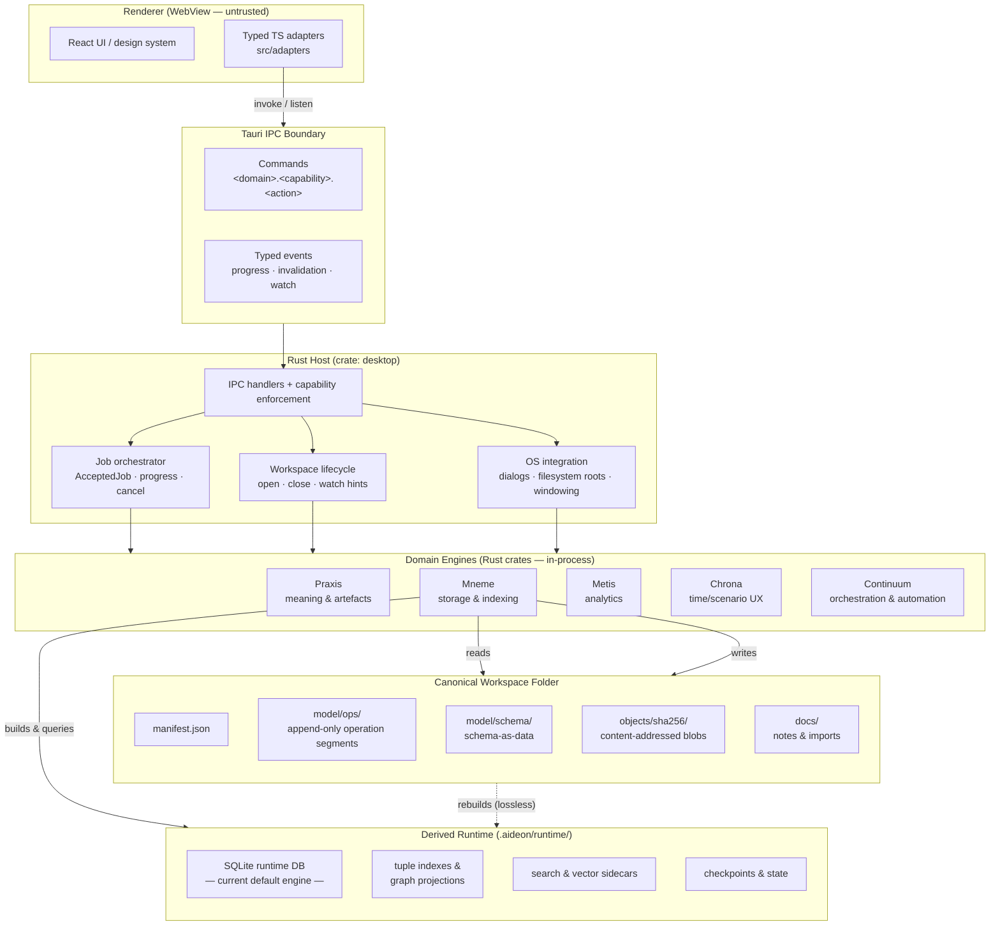

# Architecture Boundary Rules — Aideon Desktop

Defines which layer owns what, what each layer is forbidden from doing, where authority sits, and how the canonical workspace, derived runtime, Rust host, engines, and renderer relate to one another.

---

## Documentation Precedence

Documentation is authoritative. Update code to match documentation. Only change documentation to match existing code when the intended architecture has genuinely changed.

---

## The Boundary Thesis

Five irreducible propositions that every design decision defers to:

1. **The portable workspace folder is canonical authority.** Operations, temporal facts, schema-as-data, and content-addressed blobs live there. Every other structure is derived and rebuildable from those files alone.
2. **The renderer is disposable UI.** It is safe to restart, replace, or refactor without losing model correctness. It holds no durable truth.
3. **Rust owns all side effects.** Filesystem access, workspace IO, object access, indexing, blob ingestion, export/import, sync application, and job orchestration are Rust responsibilities, enforced at the Tauri capability boundary.
4. **Engines are replaceable behind traits.** Praxis, Mneme, Metis, Chrona, and Continuum expose typed contracts; implementations can be swapped without touching the renderer or the IPC surface.
5. **Time context is not optional.** Every read and write carries explicit valid time, asserted time (HLC), Plan/Actual layer, and optional scenario overlay. No module assumes "current state only."

---

## Layer Diagram



The derived runtime sits to the side: it is rebuilt from canonical files at any time with no data loss.

---

## Layers and Responsibilities

### Renderer (React / WebView)

The renderer is a static bundle loaded inside the WebView. It is untrusted by the OS and by the Rust host.

**Allowed:**
- Render artefact results, diagram specs, and signal surfaces received from the host.
- Maintain local UI state: selection, filters, tabs, layout, undo/redo stacks for in-flight edits.
- Call the host exclusively through typed adapter modules under `src/adapters`.
- Listen to typed push events emitted by the host (progress, invalidation, watch notifications).
- Display honest partial, stale, and generated states; propagate backpressure feedback to the user.

**Forbidden:**
- Node integration, OS APIs, or direct filesystem access of any kind.
- Spawning shell processes or loading native plugins outside Tauri's capability model.
- Direct access to the SQLite runtime database, workspace files, or blob store.
- Issuing raw HTTP requests to local or remote services as the primary communication seam.
- Opening a local HTTP/WebSocket server to bridge host logic.
- Holding or reconstructing canonical model truth independently of the host.
- Bypassing the adapter layer to call Tauri invoke directly from UI components.

---

### Tauri IPC Boundary

The boundary between renderer and Rust. Rust defines the wire shape; TypeScript consumes generated types. The renderer cannot see or influence what is not exposed here.

**Command contract rules:**
- Command names are namespaced: `<domain>.<capability>.<action>` (e.g. `workspace.lifecycle.open`, `ops.append`, `graph.slice`).
- Payloads are single JSON objects; no positional arguments.
- Every response uses the stable error envelope with machine-readable codes:  
  `WORKSPACE_NOT_FOUND`, `WORKSPACE_LOCKED`, `SCHEMA_TOO_NEW`, `CONFLICT_RECORDED`, `BACKPRESSURE`, and so on.
- Commands are capability-gated; the default posture is deny.
- Capability definitions live in `src-tauri/capabilities/default.json`.
- Rust→TS type generation runs during build; CI enforces drift is zero.

**Long-running work — accepted-work model:**

Long work does not block a command response. The pattern is:

```
renderer  →  command(payload)
host      →  AcceptedJob { job_id, status_endpoint }
host      →  event(job_id, JobProgress { … })   [0..N]
host      →  event(job_id, JobCompleted { … })  or  JobFailed { … }
```

Applies to: workspace rebuilds, large blob ingestion, re-indexing passes, export/import, sync application, analytics recalculation.

**Backpressure:**  
When the write queue is saturated, the host returns `BACKPRESSURE`. The renderer shows a queued state. Writes are not silently dropped or retried without user awareness.

**File-watch hints:**  
The host watches canonical roots (`manifest.json`, `model/ops/`, `model/schema/`, `objects/sha256/`). Watch events are hints only — the host re-reads and validates before acting. The derived runtime directory (`.aideon/runtime/`) is never watched as a trigger.

---

### Rust Host (crate `desktop`)

The single privileged process. It holds the Tauri runtime, enforces capabilities, and owns all side effects.

**Allowed:**
- Expose and enforce the typed IPC surface (commands + events).
- Apply and enforce Tauri capability and CSP configuration.
- Manage workspace lifecycle: open, close, watch, rebuild trigger, backup preparation.
- Own the job orchestrator: accept, run, progress-report, cancel, and recover long-running jobs.
- Mediate all OS integration: file dialogs, filesystem roots scoped to workspace and app data, window management.
- Hold references to engine instances and route commands to the appropriate engine trait.
- Emit typed push events to the renderer on behalf of engines.

**Forbidden:**
- Embedding domain semantics (model traversal, artefact execution, scenario resolution) inside IPC handler bodies — delegate to engine traits.
- Allowing any IPC command to block indefinitely; long work must be dispatched as an accepted job.
- Granting the renderer capabilities not declared in the capability manifest.
- Accessing workspace canonical files except through Mneme's storage interface (workspace opens and lifecycle operations are the explicit exception).
- Importing domain logic that properly belongs in an engine crate.

---

### Domain Engines (Rust crates)

In-process Rust crates called by the host through typed trait boundaries. Each engine owns a specific capability; none own another engine's capability.

| Engine | Owns |
|---|---|
| **Praxis** | Meaning: ontology, edge catalogue, artefact execution, diagram spec generation, metamodel packages |
| **Mneme** | Storage: workspace reads/writes, append-only op segments, blob store, runtime index engine, projections, invalidation |
| **Metis** | Analytics: signal surfaces, aggregation, dashboard projections |
| **Chrona** | Time/scenario UX: temporal helpers, scenario overlay resolution, Plan/Actual layer management |
| **Continuum** | Orchestration and automation: local durable executor, workflow steps, retries, compensation |

**Allowed:**
- Implement domain logic behind the engine's published trait contract.
- Perform deterministic computation independent of UI state and runtime details.
- Persist only through Mneme's storage interface; no engine accesses the runtime database directly except Mneme.
- Compose with other engines through the host (the host is the composition root); engines do not call each other peer-to-peer.

**Forbidden:**
- Importing Tauri, WebView, or UI-layer dependencies into engine crates.
- Emitting events directly to the renderer — the host owns event publication.
- Cross-engine private implementation imports that bypass published trait contracts (no engine↔engine dependency cycles).
- Spawning unmanaged background threads or tasks that cannot be observed, cancelled, or reported through the host job orchestrator.
- Coupling tightly to a specific storage engine implementation; Mneme's storage engine is replaceable behind a trait ([ADR-0004](../06-adrs/ADR-0004-storage-engine-abstraction.md)).

---

### Canonical Workspace Folder

The portable project folder is the source of truth. It is not a database file and not an opaque bundle.

```text
my-project.aideon/
  manifest.json              CANONICAL — identity, schema version, module metadata
  model/ops/                 CANONICAL — append-only operation segments (time-ordered)
  model/schema/              CANONICAL — schema-as-data
  objects/sha256/            CANONICAL — content-addressed immutable blobs
  docs/                      CANONICAL — notes, imports, unstructured attachments
  .aideon/runtime/           DERIVED   — indexes, projections, search/vector, SQLite DB
```

**Rules:**
- `model/ops/` is append-only; segments are never mutated after they are written.
- `objects/sha256/` is content-addressed; blobs are referenced by hash in the fact log, never inlined as bytes ([ADR-0003](../06-adrs/ADR-0003-content-addressed-object-store.md)).
- One single-writer queue per open workspace; concurrent writes serialise through Mneme's write queue, not through external locking.
- The workspace folder is the unit of copy, zip, share, and sync — it contains everything needed to reconstruct the effective model.

**What is canonical:**  
Operations, temporal facts, schema-as-data, blob bytes.

**What is derived (and deletable without data loss):**  
Effective graphs, adjacency indexes, tuple indexes, search and vector sidecars, the runtime database, previews, thumbnails, UI state.

---

### Derived Runtime (`.aideon/runtime/`)

An engine-pluggable local index and cache rebuilt on demand from canonical files. The current default engine is SQLite (via the `mneme` crate's storage implementation). The engine is replaceable behind the Mneme storage trait without changing the canonical workspace format or any layer above.

**Rules:**
- Deleting the entire `.aideon/runtime/` directory loses no user data; the host triggers a rebuild.
- The runtime database is never the source of truth; it is a performance cache.
- Hosted PostgreSQL, where used, is an optional adapter that materialises workspace semantics into a service store — it is not a replacement for the canonical workspace ([ADR-0001](../06-adrs/ADR-0001-workspace-is-canonical-authority.md)).
- Search indexes, vector sidecars, and graph projections carry freshness contracts managed by Mneme; they are invalidated and rebuilt as canonical files change.

---

## Canonical vs. Derived — The Deciding Rule

When the question is "where does this live?", apply this rule:

| Category | Examples | Status |
|---|---|---|
| Operations written by the user | `model/ops/*.ops` segments | **Canonical** |
| Temporal facts | Every asserted fact with valid-time and HLC | **Canonical** |
| Schema declarations | `model/schema/` files | **Canonical** |
| Blob bytes | `objects/sha256/<hash>` | **Canonical** |
| Effective graph views | Adjacency, reachability queries | **Derived** |
| Tuple indexes | Entity/edge lookup tables | **Derived** |
| Search and vector sidecars | Full-text, embedding indexes | **Derived** |
| Runtime database | SQLite DB in `.aideon/runtime/` | **Derived** |
| UI state | Selection, layout, in-flight edits | **Derived / ephemeral** |
| Blob previews and thumbnails | Rendered preview files | **Derived** |

If something is derived, it is rebuilable from canonical files alone. If it is not rebuilable, it is canonical and belongs in `model/` or `objects/`.

---

## Time-First Rule (All Layers)

Every read and write carries explicit time context. No layer may assume "current state only."

Required context fields on all operations:

| Field | Meaning |
|---|---|
| `partition_id` | Workspace partition scope |
| `valid_time` | When the fact is true in the real world |
| `asserted_time` | When the fact was recorded (HLC) |
| `layer` | `Plan` or `Actual` |
| `scenario_id` | Optional scenario overlay |

Chrona provides temporal helpers and scenario overlay resolution. Praxis and Mneme consume this context on every call. The renderer passes the current time context (from user selection or default) with every command.

See [Temporal and Scenario Context](../04-contracts/TEMPORAL-AND-SCENARIO-CONTEXT.md) for the full contract.

---

## Module Replaceability

Engines are replaceable because the host depends on their published traits, not on their implementations.

```
Host
 ├── impl MnemeStore for SqliteMneme       ← today
 ├── impl MnemeStore for HostedPostgresAdapter  ← optional; never canonical
 ├── impl PraxisEngine for DefaultPraxis
 ├── impl MetisEngine for DefaultMetis
 ├── impl ChronaEngine for DefaultChrona
 └── impl ContinuumExecutor for LocalContinuum
```

**Dependency direction rules:**

- Renderer → Host (IPC only; no direct engine dependency)
- Host → Engines (trait calls; in-process)
- Engines → Canonical workspace (through Mneme's storage interface only)
- No engine → renderer
- No engine → another engine (peer-to-peer; all composition routes through the host)
- No engine → Tauri or WebView APIs

This topology ensures that swapping an engine implementation, replacing the storage engine, or replacing the renderer does not propagate change across layers.

---

## Artefact Execution Boundary

Praxis executes artefacts and returns UI-ready results and diagram specs to the host, which forwards them to the renderer. The renderer renders results and handles interaction; it does not implement traversal semantics.

- Bounded execution is mandatory: every artefact execution carries depth, size, fan-out, and time limits.
- Artefact results reference blobs by hash; the renderer requests blob bytes through a separate IPC command if it needs them.
- Diagram specs are data payloads, not executable renderer instructions.

See [Artefacts and Viewpoints](../03-design/ARTEFACTS-AND-VIEWPOINTS.md) and [Praxis Edge Catalogue](../05-modules/praxis/EDGE-CATALOGUE.md).

---

## Security Constraints (Desktop Baseline)

| Constraint | Rule |
|---|---|
| Renderer HTTP | Forbidden as primary communication seam |
| Local TCP ports | No open ports in desktop mode |
| Filesystem access | Mediated by host; scoped to workspace directories and app data |
| Capability scope | Per-window; default deny; declared in `src-tauri/capabilities/default.json` |
| PII on export | Deny-by-default; redaction required for any export surface |
| Blob sharing | Content-addressed — a hash uniquely identifies content, not a path |
| Hosted auth | Demoted to an adapter contract; desktop default is local single-user context |

See [Security](../02-standards/SECURITY.md) for the full security posture.

---

## Versioning and Evolution

- DTO changes, error envelope changes, and command additions require updating the relevant contract documents and contract tests in the same change.
- Schema evolution is forward-only; migration is explicit and recorded ([ADR-0002](../06-adrs/ADR-0002-portable-workspace-format.md)).
- A hosted/remote adapter (e.g. PostgreSQL materialisation) is an engine swap behind the Mneme storage trait, not a UI fork and not a change to the IPC surface.
- The renderer continues to call typed adapters only; it is not aware of whether the persistence implementation is local or remote.

---

## Cross-References

| Document | Relationship |
|---|---|
| [Module Dependency Map](./MODULE-DEPENDENCY-MAP.md) | Full crate dependency graph |
| [Desktop-First Workspace](../03-design/DESKTOP-FIRST-WORKSPACE.md) | The design thesis this document enforces |
| [Contracts and Schemas](../04-contracts/CONTRACTS-AND-SCHEMAS.md) | IPC payload and error envelope contracts |
| [Temporal and Scenario Context](../04-contracts/TEMPORAL-AND-SCENARIO-CONTEXT.md) | Time context fields and resolution rules |
| [Accepted Work and Events](../04-contracts/ACCEPTED-WORK-AND-EVENTS.md) | AcceptedJob lifecycle and event shapes |
| [Projection and Invalidation](../04-contracts/PROJECTION-AND-INVALIDATION.md) | How derived state is invalidated and rebuilt |
| [Mneme — Runtime and Engine](../05-modules/mneme/RUNTIME-AND-ENGINE.md) | Storage engine abstraction and write queue |
| [Host module](../05-modules/host/README.md) | Tauri runtime, capabilities, IPC handlers |
| [ADR-0001](../06-adrs/ADR-0001-workspace-is-canonical-authority.md) | Workspace is canonical authority |
| [ADR-0002](../06-adrs/ADR-0002-portable-workspace-format.md) | Portable workspace format |
| [ADR-0003](../06-adrs/ADR-0003-content-addressed-object-store.md) | Content-addressed object store |
| [ADR-0004](../06-adrs/ADR-0004-storage-engine-abstraction.md) | Storage engine abstraction |
| [ADR-0005](../06-adrs/ADR-0005-sync-and-conflict-model.md) | Sync and conflict model |
| [ADR-0006](../06-adrs/ADR-0006-tauri-trust-boundary-and-typed-ipc.md) | Tauri trust boundary and typed IPC |
| [ADR-0007](../06-adrs/ADR-0007-deterministic-package-export.md) | Deterministic package export |
