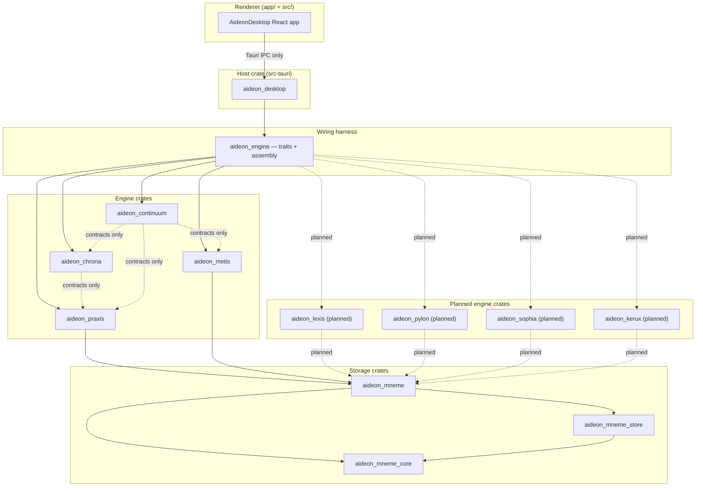

# Module Dependency Map

The allowed dependency graph for Aideon Desktop's Rust crates and the renderer, the role of the `engine` harness crate, where the four planned modules attach, and how the acyclic invariant is enforced. This document is the building-block view (arc42) at crate granularity; the rules it draws are stated in [`boundary/dependency-rules.md`](./boundary/dependency-rules.md), and the same structure is drawn at C4 component level in [`c4/`](./c4/).

---

## Rules

Five rules govern the whole graph, regardless of how crates are later split or merged:

1. **The host depends on modules; modules do not depend on the host.** `src-tauri` composes the engine crates. No engine crate imports `aideon_desktop`.
2. **Engine-to-engine cycles are architecture violations.** If removing a crate from the graph would leave a cycle in what remains, the graph is already wrong.
3. **Shared contracts sit below their consumers.** A type shared across module boundaries belongs in a lower neutral crate, never inside a module that then forces an upward import.
4. **The design system stays domain-free.** The renderer's design-system components carry no engine logic, no IPC calls, and no business rules.
5. **The renderer depends only on the host IPC surface.** The React app calls Tauri commands and events; it never reaches an engine crate directly and never makes local HTTP calls.

---

## Crate inventory

| Crate                | Cargo name           | Role                                                                                                                                                                                                                                                                                                                                                                                                                                                                                     |
| -------------------- | -------------------- | ---------------------------------------------------------------------------------------------------------------------------------------------------------------------------------------------------------------------------------------------------------------------------------------------------------------------------------------------------------------------------------------------------------------------------------------------------------------------------------------- |
| `src-tauri`          | `aideon_desktop`     | The host: Tauri runtime, IPC handlers, capability registration, job lifecycle, workspace initialisation.                                                                                                                                                                                                                                                                                                                                                                                 |
| `crates/engine`      | `aideon_engine`      | The shared engine harness — wires the domain engine implementations behind their traits for the host, so handlers depend on trait objects, not concrete types.                                                                                                                                                                                                                                                                                                                           |
| `crates/praxis`      | `aideon_praxis`      | Metamodel, types, edge catalogue, tasks, artefact execution, integrity scoring, explainability.                                                                                                                                                                                                                                                                                                                                                                                          |
| `crates/mneme`       | `aideon_mneme`       | Re-export facade for the Mneme sub-crates; the stable public storage surface.                                                                                                                                                                                                                                                                                                                                                                                                            |
| `crates/mneme_core`  | `aideon_mneme_core`  | Bitemporal op log, schema-as-data, projection traits, storage abstraction traits — the neutral contract layer.                                                                                                                                                                                                                                                                                                                                                                           |
| `crates/mneme_store` | `aideon_mneme_store` | Engine implementations of the storage trait for the **derived runtime cache** — _not_ the datastore. The canonical datastore is the portable workspace folder (op log, schema, blobs); these engines only build and serve the rebuildable `.aideon/runtime/` cache. SQLite is the current default; an alternative engine, or a hosted adapter, may be swapped behind the trait without changing the canonical format, per [ADR-0004](../06-adrs/ADR-0004-storage-engine-abstraction.md). |
| `crates/metis`       | `aideon_metis`       | Analytics algorithms and ranking jobs.                                                                                                                                                                                                                                                                                                                                                                                                                                                   |
| `crates/chrona`      | `aideon_chrona`      | Time and scenario primitives, Viewpoint resolution, temporal helpers.                                                                                                                                                                                                                                                                                                                                                                                                                    |
| `crates/continuum`   | `aideon_continuum`   | Local durable executor, scheduling, connector orchestration.                                                                                                                                                                                                                                                                                                                                                                                                                             |
| `app/` + `src/`      | — (renderer)         | React renderer, design system, workspace surfaces, IPC adapters, DTOs.                                                                                                                                                                                                                                                                                                                                                                                                                   |
| _planned_            | `aideon_lexis`       | Search and discovery — full-text and semantic retrieval, bounded and Viewpoint-aware.                                                                                                                                                                                                                                                                                                                                                                                                    |
| _planned_            | `aideon_pylon`       | Interchange — import/export and connectors.                                                                                                                                                                                                                                                                                                                                                                                                                                              |
| _planned_            | `aideon_sophia`      | AI assistance — LLM-assisted authoring behind guardrails; all output Generated.                                                                                                                                                                                                                                                                                                                                                                                                          |
| _planned_            | `aideon_kerux`       | Reporting and publishing — deterministic briefings and packaged outputs.                                                                                                                                                                                                                                                                                                                                                                                                                 |

The planned crates are documented as design intent under **[ADR-0011](../06-adrs/ADR-0011-module-taxonomy-and-boundaries.md)** (Module taxonomy and boundaries); they do not yet exist as crates.

---

## The `engine` crate's role

The `engine` crate is the **wiring seam**, not a domain engine. It holds the trait definitions the host programmes against and the assembly logic that binds each concrete engine (Praxis, Mneme, Metis, Chrona, Continuum, and later the planned engines) to its trait, producing the set of trait objects the host's IPC handlers route to. This is what lets the host be the composition root without depending on any engine's concrete type: the host depends on `engine`'s traits, `engine` depends on the concrete crates, and a handler never names a concrete engine.

Because `engine` sits between the host and the domain crates in the wiring direction, it must not become a back-channel for engine-to-engine coupling: it composes engines, it does not let them import one another. A shared type that two engines need still drops to a lower neutral crate (`mneme_core` or a dedicated contracts crate), not into `engine`.

---

## Allowed dependency graph

The graph below shows the current crates as solid implementation dependencies and contract-only edges as dashed; the planned engines are shown attaching at their boundary.



_Figure 1 — The allowed crate dependency graph. Solid arrows are implementation dependencies; dashed arrows are contract-only edges or planned attachments. The planned engines attach via the `engine` harness and read through Mneme, introducing no cycle._

---

## Allowed and forbidden edges

`A → B` means A may depend on B.

| From                                                      | To                                                           | Status        | Notes                                                               |
| --------------------------------------------------------- | ------------------------------------------------------------ | ------------- | ------------------------------------------------------------------- |
| `renderer`                                                | `aideon_desktop` (IPC)                                       | **allowed**   | Tauri commands and events only; no crate import.                    |
| `renderer`                                                | any engine or storage crate                                  | **forbidden** | The renderer has no Rust crate access.                              |
| `aideon_desktop`                                          | `aideon_engine`                                              | **allowed**   | The host programmes against the harness traits.                     |
| `aideon_engine`                                           | `aideon_praxis` / `chrona` / `metis` / `continuum` / `mneme` | **allowed**   | The harness assembles each engine behind its trait.                 |
| any engine crate                                          | `aideon_desktop`                                             | **forbidden** | Modules never depend on the host.                                   |
| any engine crate                                          | `aideon_engine`                                              | **forbidden** | The harness composes engines; engines do not depend on the harness. |
| `aideon_praxis`                                           | `aideon_mneme`                                               | **allowed**   | The semantic engine reads and writes via the storage facade.        |
| `aideon_praxis`                                           | `aideon_metis` / `chrona` / `continuum`                      | **forbidden** | No lateral engine dependency; composition routes through the host.  |
| `aideon_metis`                                            | `aideon_mneme`                                               | **allowed**   | Analytics reads projections via the storage facade.                 |
| `aideon_metis`                                            | `aideon_praxis` contracts                                    | **allowed**   | May consume semantic request DTOs and scope definitions.            |
| `aideon_metis`                                            | `aideon_praxis` internals                                    | **forbidden** | No coupling to the rule engine or metamodel publisher.              |
| `aideon_metis`                                            | `aideon_chrona` / `continuum`                                | **forbidden** | No lateral engine dependency.                                       |
| `aideon_chrona`                                           | `aideon_mneme`                                               | **allowed**   | Time-aware fact reads via the storage facade.                       |
| `aideon_chrona`                                           | `aideon_praxis` contracts                                    | **allowed**   | May consume semantic context shapes and stable identifiers.         |
| `aideon_chrona`                                           | `aideon_praxis` internals                                    | **forbidden** | Contract/DTO types only, never rule-engine or metamodel internals.  |
| `aideon_chrona`                                           | `aideon_metis` / `continuum`                                 | **forbidden** | No lateral engine dependency.                                       |
| `aideon_continuum`                                        | `aideon_mneme`                                               | **allowed**   | Persistence workflows.                                              |
| `aideon_continuum`                                        | `aideon_praxis` / `metis` / `chrona` contracts               | **allowed**   | Capability traits and workflow-safe request/result types only.      |
| `aideon_continuum`                                        | any engine internals                                         | **forbidden** | The orchestrator must not reach into private helpers.               |
| `aideon_mneme`                                            | `aideon_mneme_core`                                          | **allowed**   | The facade re-exports core traits.                                  |
| `aideon_mneme`                                            | `aideon_mneme_store`                                         | **allowed**   | The facade re-exports concrete adapters.                            |
| `aideon_mneme_store`                                      | `aideon_mneme_core`                                          | **allowed**   | The store implements core traits.                                   |
| `aideon_mneme_core`                                       | any engine                                                   | **forbidden** | The base contract layer has no engine dependencies.                 |
| `aideon_mneme_store`                                      | any engine                                                   | **forbidden** | Store adapters have no engine dependencies.                         |
| `aideon_lexis` / `pylon` / `sophia` / `kerux` _(planned)_ | `aideon_mneme`                                               | **allowed**   | Planned engines read through the storage facade.                    |
| `aideon_lexis` / `pylon` / `sophia` / `kerux` _(planned)_ | any other engine internals                                   | **forbidden** | Same acyclic rule as the current engines.                           |
| design-system components                                  | any engine crate                                             | **forbidden** | The design system stays domain-free.                                |

---

## Forbidden cycles

These cycles are violations regardless of how they arise:

- `praxis → metis → praxis`
- `praxis → chrona → praxis`
- `praxis → continuum → praxis`
- `metis → chrona → metis`
- `continuum → desktop → continuum`
- `mneme_core → mneme_store → mneme_core`
- any `engine → renderer → desktop → engine` shortcut

If two modules need each other's types, the shared type belongs in a lower neutral contract crate — not inside either module.

---

## How the acyclic invariant is enforced

The invariant is enforced by three mechanisms, strongest first:

1. **The build rejects cycles.** Cargo's resolver does not permit a dependency cycle between crates; any cycle introduced through `Cargo.toml` fails the build. This is the hard backstop — a cyclic graph cannot compile.
2. **The crate split removes the temptation.** Contracts that would otherwise force a lateral or upward import live in lower neutral crates: storage-adjacent contracts in `aideon_mneme_core`, and cross-engine contracts in a dedicated `aideon_contracts` crate when they span multiple engines. Because the shared type already lives below both consumers, no engine needs to import another to reach it.
3. **The taxonomy fixes ownership.** Each capability belongs to exactly one engine, per **[ADR-0011](../06-adrs/ADR-0011-module-taxonomy-and-boundaries.md)**. Two engines do not grow a mutual dependency by drifting into one another's responsibility, because the responsibility has a single owner.

Candidate types for the neutral contract surfaces include temporal request/response DTOs (valid-time range, asserted-time range, scenario key), analytics result DTOs, workflow run and event DTOs, metamodel key and edge-catalogue types, and artefact identity types shared across engines.

---

## Call patterns

The runtime call shapes that the graph permits:

**Artefact execution**

```text
renderer
  → desktop IPC command
    → praxis capability (via engine harness)
      → mneme (read/write ops + schema)
    ← artefact result
  ← Tauri event
```

**Analytics job**

```text
renderer
  → desktop IPC command (accepted-work response)
    → continuum (enqueues job)
      → metis capability (analytics algorithm)
        → mneme (projection read)
      → mneme (result write)
    ← job progress event
  ← Tauri event stream
```

**Temporal comparison**

```text
renderer
  → desktop IPC command with explicit valid-time + scenario context
    → chrona temporal helper
      → mneme (time-aware fact reads)
    ← temporal payload
  ← Tauri event
```

**Connector ingest**

```text
desktop (scheduled trigger)
  → continuum (connector workflow)
    → praxis (validation / artefact shaping) [contract-only]
    → mneme (op append)
  ← workflow completion event
```

---

## References & standards

_Informative:_

- **arc42** template — the building-block view this document realises.

Full bibliography: [`../02-standards/STANDARDS-REGISTER.md`](../02-standards/STANDARDS-REGISTER.md).

## Related documents

| Document                                                                                                         | What it covers                                                |
| ---------------------------------------------------------------------------------------------------------------- | ------------------------------------------------------------- |
| [`boundary/dependency-rules.md`](./boundary/dependency-rules.md)                                                 | The dependency directions and the acyclic invariant in prose. |
| [`boundary/README.md`](./boundary/README.md)                                                                     | The boundary rules these crates realise.                      |
| [`c4/README.md`](./c4/README.md)                                                                                 | The same structure at C4 container and component level.       |
| [`../05-modules/mneme/README.md`](../05-modules/mneme/README.md)                                                 | Mneme: storage, op log, the storage trait.                    |
| [`../05-modules/praxis/README.md`](../05-modules/praxis/README.md)                                               | Praxis: meaning and artefact execution.                       |
| [`../05-modules/metis/README.md`](../05-modules/metis/README.md)                                                 | Metis: analytics.                                             |
| [`../05-modules/chrona/README.md`](../05-modules/chrona/README.md)                                               | Chrona: time and scenario.                                    |
| [`../05-modules/continuum/README.md`](../05-modules/continuum/README.md)                                         | Continuum: orchestration.                                     |
| [`../05-modules/host/README.md`](../05-modules/host/README.md)                                                   | The host: composition root and IPC.                           |
| [`../06-adrs/ADR-0011-module-taxonomy-and-boundaries.md`](../06-adrs/ADR-0011-module-taxonomy-and-boundaries.md) | Module taxonomy and boundaries.                               |
