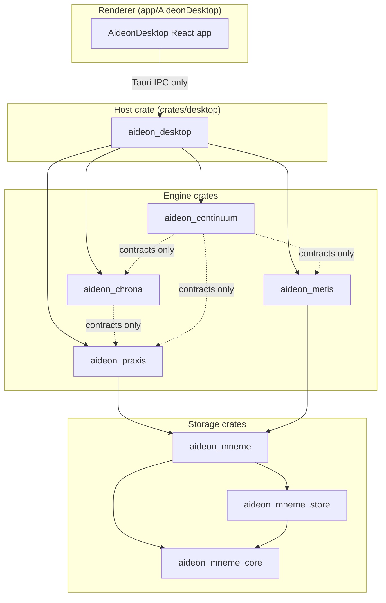

# Module Dependency Map

Defines the allowed dependency graph for Aideon Desktop's Rust crates and the renderer app.

## Rules

Four rules govern the entire graph. They hold regardless of how crates are split or merged in future.

1. **Host depends on modules; modules do not depend on host.** `crates/desktop` composes capability crates. No engine crate imports `aideon_desktop`.
2. **Engine-to-engine cycles are architecture violations.** If removing a crate from the graph would produce a cycle in what remains, the graph is already wrong.
3. **Shared contracts sit below their consumers.** Types shared across module boundaries belong in a lower, neutral crate — not inside a module that then forces an upward import.
4. **The design system stays domain-free.** The renderer's design-system components carry no engine logic, no IPC calls, and no business rules.
5. **The renderer depends only on the host IPC surface.** The React app calls Tauri commands and events; it never reaches engine crates directly and never makes local HTTP calls.

## Crate Inventory

| Crate | Cargo name | Role |
|---|---|---|
| `crates/desktop` | `aideon_desktop` | Tauri runtime, IPC command handlers, capability registration, job lifecycle, workspace initialisation |
| `crates/praxis` | `aideon_praxis` | Metamodel, task and artefact APIs, integrity, rule engine |
| `crates/mneme` | `aideon_mneme` | Re-export facade for the Mneme sub-crates; stable public surface |
| `crates/mneme_core` | `aideon_mneme_core` | Bi-temporal op log, schema-as-data, projection traits, storage abstraction traits |
| `crates/mneme_store` | `aideon_mneme_store` | SeaORM-backed store implementations (SQLite / Postgres / MySQL adapters) |
| `crates/metis` | `aideon_metis` | Analytics algorithms and ranking jobs |
| `crates/chrona` | `aideon_chrona` | Time/scenario UX primitives and temporal helpers |
| `crates/continuum` | `aideon_continuum` | Local durable executor, scheduling, connector orchestration |
| `app/AideonDesktop` | — (renderer) | React renderer, design system, workspace surfaces, IPC adapters, DTOs |

## Allowed Dependency Graph



Solid arrows are full implementation dependencies. Dashed arrows are contract-only edges: the consuming crate imports trait definitions and DTO types but not implementation internals.

## Allowed and Forbidden Edges

`A → B` means A may depend on B.

| From | To | Status | Notes |
|---|---|---|---|
| `renderer` | `aideon_desktop` (IPC) | **allowed** | Tauri commands and events only; no crate import |
| `renderer` | any engine or storage crate | **forbidden** | renderer has no Rust crate access |
| `aideon_desktop` | `aideon_praxis` | **allowed** | host composes the semantic engine |
| `aideon_desktop` | `aideon_chrona` | **allowed** | host composes the temporal engine |
| `aideon_desktop` | `aideon_metis` | **allowed** | host composes the analytics engine |
| `aideon_desktop` | `aideon_continuum` | **allowed** | host composes the orchestrator |
| `aideon_desktop` | `aideon_mneme` | **allowed** | host may open/close the workspace store |
| any engine crate | `aideon_desktop` | **forbidden** | modules never depend on the host |
| `aideon_praxis` | `aideon_mneme` | **allowed** | semantic engine reads and writes via storage facade |
| `aideon_praxis` | `aideon_metis` | **forbidden** | Praxis does not import the analytics engine; the host or Continuum composes the two, or shared types drop to a neutral contract surface |
| `aideon_praxis` | `aideon_continuum` | **forbidden** | workflow initiation is a host concern; Praxis exposes capability traits that Continuum consumes |
| `aideon_praxis` | `aideon_chrona` | **forbidden** | semantic engine does not depend on temporal engine |
| `aideon_metis` | `aideon_mneme` | **allowed** | analytics reads projections via storage facade |
| `aideon_metis` | `aideon_praxis` contracts | **allowed** | may consume semantic request DTOs and scope definitions |
| `aideon_metis` | `aideon_praxis` internals | **forbidden** | no coupling to rule engine or metamodel publisher |
| `aideon_metis` | `aideon_chrona` | **forbidden** | no lateral engine dependency |
| `aideon_metis` | `aideon_continuum` | **forbidden** | no lateral engine dependency |
| `aideon_chrona` | `aideon_praxis` contracts | **allowed** | may consume semantic context shapes and stable identifiers |
| `aideon_chrona` | `aideon_praxis` internals | **forbidden** | Chrona consumes only contract/DTO types from Praxis, never rule-engine or metamodel internals |
| `aideon_chrona` | `aideon_mneme` | **allowed** | time-aware fact reads via storage facade |
| `aideon_chrona` | `aideon_metis` | **forbidden** | no lateral engine dependency |
| `aideon_chrona` | `aideon_continuum` | **forbidden** | no lateral engine dependency |
| `aideon_continuum` | `aideon_mneme` | **allowed** | persistence workflows |
| `aideon_continuum` | `aideon_praxis` contracts | **allowed** | capability traits and workflow-safe request/result types |
| `aideon_continuum` | `aideon_metis` contracts | **allowed** | capability traits only |
| `aideon_continuum` | `aideon_chrona` contracts | **allowed** | capability traits only |
| `aideon_continuum` | any engine internals | **forbidden** | orchestrator must not reach into private helpers |
| `aideon_mneme` | `aideon_mneme_core` | **allowed** | facade re-exports core traits |
| `aideon_mneme` | `aideon_mneme_store` | **allowed** | facade re-exports concrete adapters |
| `aideon_mneme_store` | `aideon_mneme_core` | **allowed** | store implements core traits |
| `aideon_mneme_core` | any engine | **forbidden** | base contract layer has no engine dependencies |
| `aideon_mneme_store` | any engine | **forbidden** | store adapters have no engine dependencies |
| design-system components | any engine crate | **forbidden** | design system stays domain-free |

## Forbidden Cycles

These cycles are architecture violations regardless of how they arise.

- `praxis → metis → praxis`
- `praxis → chrona → praxis`
- `praxis → continuum → praxis`
- `metis → chrona → metis`
- `continuum → desktop → continuum`
- any engine → renderer → desktop → engine shortcut
- `mneme_core → mneme_store → mneme_core`

If two modules need each other's types, the shared type belongs in a lower neutral contract crate — not inside either module.

## Neutral Contract Surfaces

When a dependency is logically required across module boundaries, the contract moves down rather than creating an upward or lateral import.

Candidate types for neutral contract crates:

- temporal request and response DTOs (valid-time range, asserted-time range, scenario key)
- analytics result DTOs
- workflow run and event DTOs
- metamodel key and edge catalogue types
- artefact identity types shared across engines

These belong below the engines that consume them — either in `aideon_mneme_core` for storage-adjacent contracts, or in a dedicated `aideon_contracts` crate when they span multiple engines.

## Call Patterns

### Artefact execution

```
renderer
  → desktop IPC command
    → praxis capability
      → mneme (read/write ops + schema)
    ← artefact result
  ← Tauri event
```

### Analytics job

```
renderer
  → desktop IPC command (accepted-work response)
    → continuum (enqueues job)
      → metis capability (analytics algorithm)
        → mneme (projection read)
      → mneme (result write)
    ← job progress event
  ← Tauri event stream
```

### Temporal comparison

```
renderer
  → desktop IPC command with explicit valid-time + scenario context
    → chrona temporal helper
      → mneme (time-aware fact reads)
    ← temporal payload
  ← Tauri event
```

### Connector ingest

```
desktop (scheduled trigger)
  → continuum (connector workflow)
    → praxis (validation / artefact shaping) [contract-only]
    → mneme (op append)
  ← workflow completion event
```

## References

- [Architecture boundary rules](./ARCHITECTURE-BOUNDARY.md)
- [Desktop-first workspace thesis](../03-design/DESKTOP-FIRST-WORKSPACE.md)
- [Design governance](../02-standards/DESIGN-GOVERNANCE.md)
- [Mneme module](../05-modules/mneme/README.md)
- [Praxis module](../05-modules/praxis/README.md)
- [Metis module](../05-modules/metis/README.md)
- [Chrona module](../05-modules/chrona/README.md)
- [Continuum module](../05-modules/continuum/README.md)
- [Host module](../05-modules/host/README.md)
