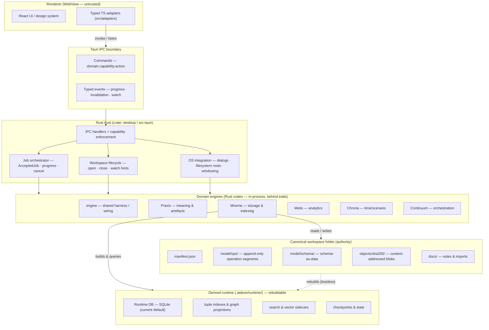

# Architecture Boundary

The boundary rules for Aideon Desktop — which layer owns what, what each layer is forbidden from doing, where authority
sits, and how the canonical workspace, derived runtime, Rust host, engines, and renderer relate. These rules are the
architecture's load-bearing constraints: every design decision in the corpus defers to them. This folder is the entry
point; each file below answers one question.

---

## Contents

1. [Boundary thesis](./boundary-thesis.md) — the five irreducible propositions and documentation precedence.
2. [Canonical vs derived](./canonical-vs-derived.md) — the deciding rule, the workspace layout, and the
   rebuild-correctness statement.
3. [Layers and responsibilities](./layers-and-responsibilities.md) — renderer, IPC, host, engines, canonical, derived:
   allowed and forbidden tables.
4. [Dependency rules](./dependency-rules.md) — replaceability, dependency directions, the acyclic invariant.
5. [Time-first rule](./time-first-rule.md) — the time context every read and write carries.
6. [Security constraints](./security-constraints.md) — the desktop security baseline and threat frame.
7. [Artefact execution boundary](./artefact-execution-boundary.md) — where artefacts execute; what the renderer may not
   do.
8. [Versioning and evolution](./versioning-and-evolution.md) — how the boundary holds while contracts, schema, and
   engines evolve.

---

## The shape in one diagram

The layer diagram below shows the whole boundary at once: the renderer is disposable UI, the host is the single trust
boundary, the engines are in-process crates behind traits, the canonical workspace is authority, and the derived runtime
sits to the side as a rebuildable cache.

_Figure 1 — The boundary at a glance: the host mediates the renderer and the engines; Mneme is the only engine that
touches storage; the derived runtime is rebuilt from canonical files at any time with no data loss._

The detailed treatment of each band is in [`layers-and-responsibilities.md`](./layers-and-responsibilities.md). The
whole structure is drawn at C4 container and component level in [`../c4/`](../c4/).

---

## Related documents

| Document                                                                                     | What it covers                                                             |
| -------------------------------------------------------------------------------------------- | -------------------------------------------------------------------------- |
| [`../module-dependency-map.md`](../module-dependency-map.md)                                 | The full crate dependency graph and how the acyclic invariant is enforced. |
| [`../quality-attributes.md`](../quality-attributes.md)                                       | The quality scenarios these boundaries are designed to satisfy.            |
| [`../../03-design/DESKTOP-FIRST-WORKSPACE.md`](../../03-design/DESKTOP-FIRST-WORKSPACE.md)   | The design thesis these rules enforce.                                     |
| [`../../04-contracts/CONTRACTS-AND-SCHEMAS.md`](../../04-contracts/CONTRACTS-AND-SCHEMAS.md) | The IPC payload and error-envelope contracts.                              |
| [`../../06-adrs/ADRS.md`](../../06-adrs/ADRS.md)                                             | The decisions that fix these invariants.                                   |
