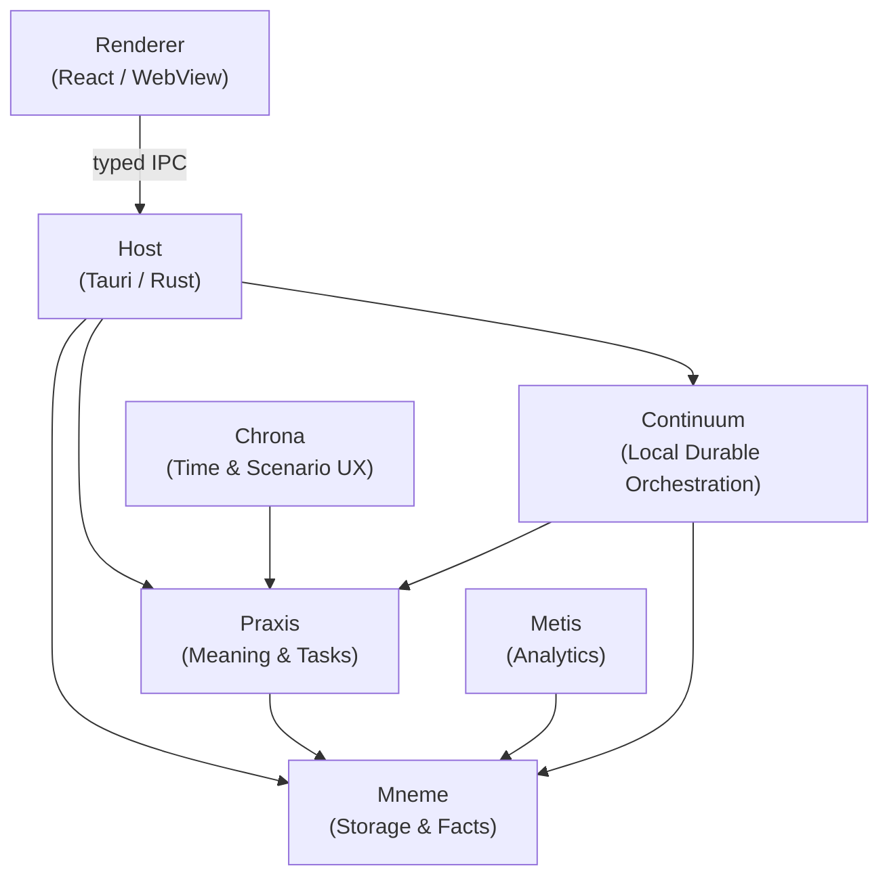
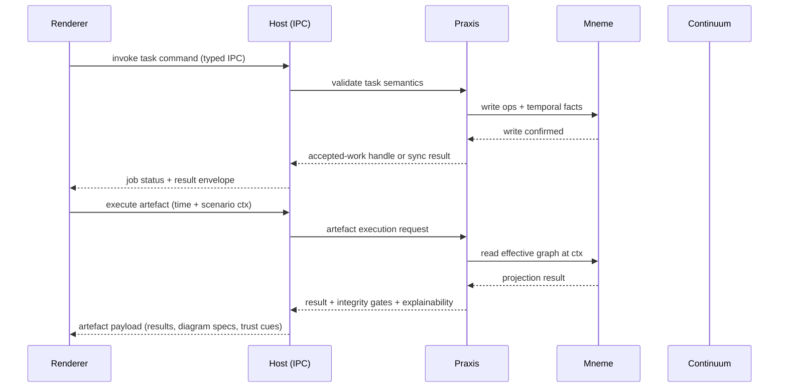

# Aideon Desktop — Evergreen Design Overview

Aideon Desktop is a desktop-first, local-first, time-first digital-twin modelling app delivered as a Tauri v2 application with a Rust core and a React renderer. This document is the spine all downstream design, UX, and module docs inherit from.

---

## Design axioms

These invariants are non-negotiable. Every module, renderer surface, and host capability must stay consistent with them.

### 1. Workspace is the canonical authority

The canonical source of truth is the **portable workspace folder**, not a database file and not a local HTTP service.

```text
my-project.aideon/
  manifest.json              CANONICAL
  model/ops/                 CANONICAL  append-only operation segments
  model/schema/              CANONICAL  schema-as-data
  objects/sha256/            CANONICAL  content-addressed blobs
  docs/                      CANONICAL  notes, imports
  .aideon/runtime/           DERIVED    indexes, projections, search/vector, checkpoints
```

Everything in `model/` and `objects/` is canonical. Everything under `.aideon/runtime/` is derived and disposable: delete it and the project still opens; rebuild it and you recover the same effective graph. See [DESKTOP-FIRST-WORKSPACE.md](./DESKTOP-FIRST-WORKSPACE.md) for the full authority-split rationale.

### 2. Ops and temporal facts are canonical; everything else is derived

The append-only operation log is the durable record. Derived tables — effective graphs, tuple indexes, adjacency structures, search/vector sidecars, projection caches, analytics outputs — are rebuildable from canonical files alone. When any derived output disagrees with the op log, the op log wins.

### 3. Time is explicit and first-class

All reads and writes carry an explicit time context:

- **valid time** — what is modelled as true in the world
- **asserted time** — what the system knew and when (recorded as an HLC timestamp)
- **layer** — Plan or Actual precedence
- **scenario** — baseline or what-if overlay

Time and scenario are model-level context, not UI-only filters. Chrona owns the UX for temporal navigation and scenario composition; see [docs/04-contracts/TEMPORAL-AND-SCENARIO-CONTEXT.md](../04-contracts/TEMPORAL-AND-SCENARIO-CONTEXT.md).

### 4. Meaning is separate from storage

**Praxis** defines semantics: the metamodel, master types, domain types, tasks, artefact execution, integrity scoring, and explainability. **Mneme** owns persistence: the operation log, temporal facts, schema-as-data, blob storage, and all derived indexes. Neither module imports from the other's implementation; they communicate through typed traits. See [docs/05-modules/praxis/README.md](../05-modules/praxis/README.md) and [docs/05-modules/mneme/README.md](../05-modules/mneme/README.md).

### 5. Artefacts are the primary UX product

Users consume **artefacts** — views, catalogues, matrices, maps, reports, and pages — executed against an explicit time and scenario context. The renderer does not embed traversal rules, analytics logic, or semantic meaning. Artefact results carry their own explainability, integrity gates, and provenance signals. See [ARTEFACTS-AND-FAMILIES.md](./ARTEFACTS-AND-FAMILIES.md).

### 6. Host is the security boundary

The renderer (React/WebView) is untrusted and disposable. All side effects — filesystem writes, job dispatch, capability invocation, workspace lifecycle — flow through the Rust host via **typed Tauri IPC**. The renderer makes no direct filesystem calls and opens no local HTTP ports. The desktop baseline is offline-first.

### 7. Accepted work with backpressure

Non-trivial writes, recalculations, import/export, and propagation flows are accepted first, then executed through a **single-writer queue** with explicit status, progress events, cancellation, and retry semantics. Long-running work is never a silent spinner. Continuum owns local durable orchestration. The IPC surface enforces backpressure: the renderer cannot flood the host with concurrent mutations.

### 8. Content-addressed blobs

Binary content (images, attachments, generated assets) lives outside the fact log in `objects/sha256/`, referenced by hash. The fact log never embeds raw bytes. Blob integrity is verifiable by hash. Exports are deterministic and reproducible.

### 9. Storage engine is pluggable

Mneme's persistence layer sits behind a typed trait with a single-writer queue. The local default engine is replaceable without changing modules above it. Hosted/Postgres is an optional adapter, not the definition of truth.

### 10. Bounded and explainable execution

Every user-triggered computation carries explicit bounds: fanout limits, depth limits, size limits, duration limits. Analytics and time-travel outputs expose their reasoning. The product says so when results are partial, sampled, stale, inferred, or generated.

---

## Module map



| Module        | Responsibility                                                                                        |
| ------------- | ----------------------------------------------------------------------------------------------------- |
| **Praxis**    | Metamodel, master/domain types, task semantics, artefact execution, integrity scoring, explainability |
| **Mneme**     | Operation log, temporal facts, schema-as-data, blob store, indexes, projections, engine trait         |
| **Metis**     | Analytics, scoring, pattern detection, ML-assisted insights                                           |
| **Chrona**    | Temporal navigation UX, scenario composition, Plan/Actual layer switching                             |
| **Continuum** | Local durable job executor, retry, cancellation, progress events                                      |
| **Host**      | Tauri runtime, IPC surface, capabilities, workspace lifecycle, OS integration                         |

Module substitution is possible at any typed boundary. No engine-to-engine cycles are permitted. The design system is domain-free and carries no module-specific semantics.

---

## The shell

The app uses one shared shell with four stable regions. All workspaces render inside this shell and do not bring their own chrome.

```
┌─────────────────────────────────────────────────────┐
│  TOOLBAR  workspace identity · time + scenario · search · status  │
├─────────┬───────────────────────────────┬───────────┤
│         │                               │           │
│  NAV    │        CONTENT SURFACE        │ INSPECTOR │
│         │                               │           │
│         │                               │           │
└─────────┴───────────────────────────────┴───────────┘
```

- **Navigation** — workspace switching, artefact library, saved structures, pinned views, scenario entry points.
- **Toolbar** — workspace identity, explicit time and scenario controls, search and command entry, job status affordances, export entry points.
- **Content surface** — the dominant work area; renders the active artefact (canvas, graph, catalogue, matrix, map, report, guided form). Stays focused on the current question.
- **Inspector** — responds to selection; shows properties, provenance, quality signals, explanation, valid edits, contextual actions, and version or scenario comparison for the selected object or result. Selection is global within a workspace.

See [UX-DESIGN.md](./UX-DESIGN.md) for the full interaction contract and [DESIGN-SYSTEM.md](./DESIGN-SYSTEM.md) for shell primitives.

---

## How modules fit together

### Semantic spine

Praxis centres the twin around a normative strategy-to-execution spine used for integrity scoring, bounded traversal, and explainability:

**Intent → Value → Capability → Execution → Technology → Change**

This is not a UI flow. It is a semantic expectation that:

- drives integrity scoring (gaps along the spine reduce confidence)
- sets bounded traversal defaults for artefact execution
- enables explainability paths ("why does this capability matter?" traces along the spine)

### End-to-end flow: facts to UX



1. User triggers a **task** (Praxis validates semantics, writes through Mneme).
2. Long-running work is handed to Continuum; the renderer receives an accepted-work handle immediately.
3. User requests an **artefact** at an explicit time and scenario context.
4. Praxis reads the effective graph from Mneme and returns result data, diagram specs, integrity gates, and explainability payloads.
5. The renderer renders results and drives the inspector and actions from selection.

---

## Shared vocabulary

| Term              | Definition                                                                                                                   |
| ----------------- | ---------------------------------------------------------------------------------------------------------------------------- |
| **Workspace**     | The canonical portable folder that is the unit of isolation and portability.                                                 |
| **Partition**     | The runtime boundary for all facts and schema within a workspace.                                                            |
| **Scenario**      | An overlay within a partition for what-if changes. Baseline is always the implicit anchor.                                   |
| **Master type**   | A stable structural role in the semantic spine (Actor, Intent, Value, Capability, Execution, Technology, Structure, Change). |
| **Domain type**   | An extensible business concept inheriting from a master type.                                                                |
| **Element**       | A node instance of a domain type.                                                                                            |
| **Relationship**  | An edge instance of a domain verb mapped to master semantics.                                                                |
| **Task**          | A user-facing authoring operation that mutates the twin (create, link, set, move, tombstone).                                |
| **Artefact**      | A stored declarative definition executed at a time/scenario context to produce a UI-ready result.                            |
| **Op**            | An append-only record in the canonical operation log.                                                                        |
| **Projection**    | A derived read-optimised structure rebuilt from the op log.                                                                  |
| **Blob**          | A content-addressed binary stored by SHA-256 hash under `objects/sha256/`.                                                   |
| **Accepted work** | A job that has been accepted by the host and is executing asynchronously with observable status.                             |
| **HLC**           | Hybrid Logical Clock timestamp used for asserted time across distributed writes.                                             |

---

## Trust and honesty obligations

Every artefact result and long-running operation must carry honest state signals. The renderer must surface these; it must not paper over them.

| Signal             | When required                                                                   |
| ------------------ | ------------------------------------------------------------------------------- |
| Partial or bounded | Result was capped by a fanout, depth, or size limit                             |
| Stale              | The underlying projection has not been refreshed since the last canonical write |
| Inferred           | The fact was derived by an integrity or ML pass, not asserted by a user         |
| Generated          | Content was produced by an LLM or automation and has not been confirmed         |
| In progress        | Accepted work is still executing; the result shown is a prior snapshot          |
| Error              | Execution failed; partial results are shown with explicit coverage indication   |

---

## Security posture

- No renderer HTTP; renderer communicates with the host through typed IPC only.
- No open TCP ports in desktop mode.
- Filesystem access is workspace-scoped and mediated by host capabilities and OS dialogs.
- Exports are deny-by-default for PII; redaction is enforced before any export path.
- Authentication in a future hosted adapter is enforced at the host layer, never in the renderer.

---

## Evolution rules

- DTOs and error envelopes are versioned; forward compatibility is required across all typed IPC boundaries.
- Schema evolution is forward-only; explicit op-based migrations are the mechanism.
- Contract changes update code, tests, and contract docs in the same commit.
- Any module boundary change that affects the typed IPC surface requires a corresponding ADR update.

---

## References

| Document                                                                                               | Content                                                                      |
| ------------------------------------------------------------------------------------------------------ | ---------------------------------------------------------------------------- |
| [DESKTOP-FIRST-WORKSPACE.md](./DESKTOP-FIRST-WORKSPACE.md)                                             | Workspace authority split, canonical vs derived rules, portability rationale |
| [UX-DESIGN.md](./UX-DESIGN.md)                                                                         | Full UX interaction contract                                                 |
| [DESIGN-SYSTEM.md](./DESIGN-SYSTEM.md)                                                                 | Shell primitives, tokens, reusable blocks                                    |
| [ARTEFACTS-AND-FAMILIES.md](./ARTEFACTS-AND-FAMILIES.md)                                               | Artefact families, artefact strategy, explanation design                     |
| [METAMODEL-PACKAGES.md](./METAMODEL-PACKAGES.md)                                                       | Master types, domain types, semantic spine detail                            |
| [SIGNAL-SURFACES.md](./SIGNAL-SURFACES.md)                                                             | Trust signals, provenance, quality indicators                                |
| [docs/01-architecture/ARCHITECTURE-BOUNDARY.md](../01-architecture/ARCHITECTURE-BOUNDARY.md)           | Module boundaries and typed seams                                            |
| [docs/04-contracts/TEMPORAL-AND-SCENARIO-CONTEXT.md](../04-contracts/TEMPORAL-AND-SCENARIO-CONTEXT.md) | Temporal context contract                                                    |
| [docs/04-contracts/CONTRACTS-AND-SCHEMAS.md](../04-contracts/CONTRACTS-AND-SCHEMAS.md)                 | IPC schemas, DTO versioning                                                  |
| [docs/05-modules/praxis/README.md](../05-modules/praxis/README.md)                                     | Praxis module detail                                                         |
| [docs/05-modules/mneme/README.md](../05-modules/mneme/README.md)                                       | Mneme module detail                                                          |
| [docs/06-adrs/ADRS.md](../06-adrs/ADRS.md)                                                             | Architecture decision records                                                |
