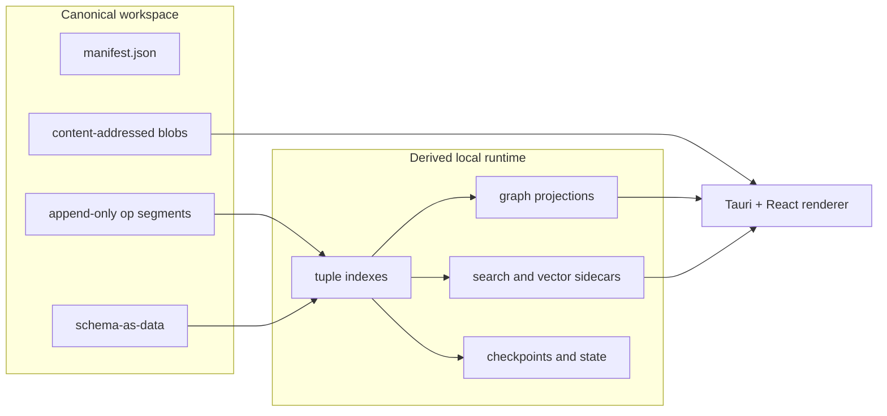

# Desktop-First Portable Workspace

The single design thesis Aideon Desktop rests on. The decisions it states are fixed in the [ADR set](../06-adrs/ADRS.md); this document explains the shape and the reasoning.

## The thesis

Aideon Desktop is a **file-first canonical workspace** plus a **derived local index engine**. The project a user opens, copies, zips, shares, syncs or backs up is a normal workspace folder containing append-only operation segments, schema-as-data, and immutable content-addressed blobs. Mneme reads that workspace and builds fast local structures — tuple indexes, graph projections, search indexes, vector sidecars, runtime checkpoints. Those structures are disposable.

Authority lives in the workspace, not in a database file and not in a local service. Operations and temporal facts are canonical; everything Mneme computes from them is derived.

## How the constraints map to the design

| Constraint                       | Design consequence                                                                         |
| -------------------------------- | ------------------------------------------------------------------------------------------ |
| Desktop-first, no server install | The canonical workspace opens locally without a service.                                   |
| Portability and sharing          | Canonical data is a folder/package, not an opaque runtime database.                        |
| Offline operation                | Writes append locally first; any sync is asynchronous.                                     |
| Multi-user merge                 | Reconcile operations and semantic facts, not file diffs.                                   |
| Binary handling                  | Blobs live outside the fact log, referenced by hash.                                       |
| Optional hosted mode             | A hosted store materialises the same workspace semantics behind the persistence interface. |

## The authority split

```text
my-project.aideon/
  manifest.json              CANONICAL
  model/ops/                 CANONICAL  append-only operation segments
  model/schema/              CANONICAL  schema-as-data
  objects/sha256/            CANONICAL  content-addressed blobs
  docs/                      CANONICAL  notes, imports
  .aideon/runtime/           DERIVED    indexes, projections, search/vector, checkpoints
```

Everything in `model/` and `objects/` is canonical. Everything in `.aideon/runtime/` is derived: delete it and the project still opens; rebuild it and you get the same effective graph. The filesystem is the source of truth; the cache is reconstructible.



## Canonical vs derived (the rule that resolves arguments)

- **Canonical:** operations, temporal facts, schema-as-data, blob bytes.
- **Derived:** effective graphs, adjacency, tuple indexes, search/vector sidecars, the runtime database, previews/thumbnails, UI state.

If the question is "where does this live?", the answer follows from this list. Anything derived is reconstructible from canonical files alone.

## Why a database file is not the project

A database file is not portable in the way the product needs: SQLite serialises writes and its WAL mode adds `-wal`/`-shm` sidecars with same-host constraints; database pages and WAL state do not map to portable semantic intent; and two divergent database files cannot be merged at the level of meaning. A folder of operations, schema, and blobs can be copied, diffed, synced, and merged semantically.

## The seven load-bearing decisions

1. Operations and temporal facts are canonical; projections are derived ([ADR-0001](../06-adrs/ADR-0001-workspace-is-canonical-authority.md)).
2. The workspace folder format is the canonical record ([ADR-0002](../06-adrs/ADR-0002-portable-workspace-format.md)).
3. Binaries are content-addressed blobs, referenced by hash ([ADR-0003](../06-adrs/ADR-0003-content-addressed-object-store.md)).
4. The storage engine is replaceable behind a trait, with a single-writer queue per workspace ([ADR-0004](../06-adrs/ADR-0004-storage-engine-abstraction.md)).
5. Sync exchanges operations and missing blob hashes; conflicts are first-class records ([ADR-0005](../06-adrs/ADR-0005-sync-and-conflict-model.md)).
6. The renderer is untrusted; Rust owns side effects through typed IPC ([ADR-0006](../06-adrs/ADR-0006-tauri-trust-boundary-and-typed-ipc.md)).
7. Export is deterministic and reproducible ([ADR-0007](../06-adrs/ADR-0007-deterministic-package-export.md)).

## See also

- [`../05-modules/mneme/RUNTIME-AND-ENGINE.md`](../05-modules/mneme/RUNTIME-AND-ENGINE.md) — keyspace, indexes, write queue, engine choice.
- [`../05-modules/mneme/SQLITE.md`](../05-modules/mneme/SQLITE.md) — the embedded-store spec.
- [`../04-contracts/TEMPORAL-AND-SCENARIO-CONTEXT.md`](../04-contracts/TEMPORAL-AND-SCENARIO-CONTEXT.md) — the temporal model carried on every read and write.
