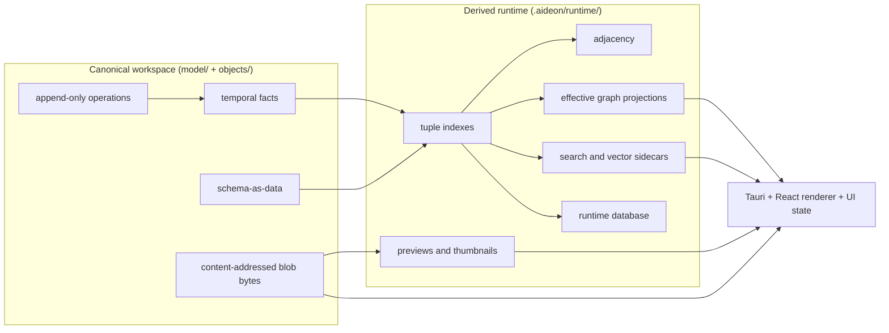

# The Authority Split

The rule that resolves arguments about where a thing lives: canonical versus derived. When two contributors disagree on
whether something belongs in the workspace or in the runtime, this rule decides. This file states the rule and shows how
canonical material flows to the user interface.

## The rule

**Canonical** material is the durable truth. It is the only thing that must survive a copy, a sync, or a rebuild. It
comprises:

- **operations** — the append-only mutations in the op log;
- temporal **facts** — the claims derived from operations and held as canonical resolution inputs;
- schema-as-data — the **metamodel** that defines what can exist;
- blob bytes — the content-addressed binary content, referenced by hash.

**Derived** material is reconstructible from canonical material alone. It exists for speed and presentation, and may be
deleted at any time. It comprises:

- **effective graph** projections;
- adjacency structures;
- tuple indexes;
- search and vector sidecars;
- the runtime database;
- previews and thumbnails;
- user-interface state.

The test is one question: _can this be rebuilt from the operations, schema, and blobs alone?_ If yes, it is derived and
lives under `.aideon/runtime/`. If no, it is canonical and lives under `model/` or `objects/`. The folder layout that
places each is in [the README](./README.md). This rule must not be redefined elsewhere; other documents reference it.

## How canonical material flows to the interface

Canonical inputs are projected into derived structures, and the renderer reads only derived structures (blob bytes
excepted, which the host streams). Nothing in the interface is authoritative; the authority sits upstream, in the
canonical files.

_Figure: canonical inputs derive the runtime structures; the renderer reads derived structures and streamed blob bytes,
never the canonical store directly._

The flow is one-directional for authority: a write enters as an **operation**, derives a **fact**, and refreshes the
projections; the renderer never writes canonical material itself. The renderer is untrusted, and Rust owns the side
effects through typed IPC; that boundary is fixed by the
[Tauri trust boundary](../../06-adrs/ADR-0006-tauri-trust-boundary-and-typed-ipc.md). The consistency model for
refreshing projections — when a derived structure is **Stale** or **Rebuilding** rather than **Fresh** — is fixed by
[ADR-0027](../../06-adrs/ADR-0027-projection-consistency-model.md).

The architecture boundary places the same split at the system level:
[`ARCHITECTURE-BOUNDARY.md`](../../01-architecture/ARCHITECTURE-BOUNDARY.md), and specifically its
[canonical-versus-derived boundary](../../01-architecture/boundary/canonical-vs-derived.md).

## References & standards

_Normative — the shape this split adopts:_

- Fowler; Young — **Event Sourcing & CQRS**. Canonical append-only operations as truth; derived read models rebuilt from
  them.

## Related documents

| Document                                                                                                | What it covers                                                |
| ------------------------------------------------------------------------------------------------------- | ------------------------------------------------------------- |
| [`./README.md`](./README.md)                                                                            | The folder layout that places canonical and derived material. |
| [The thesis](./the-thesis.md)                                                                           | Why the product is shaped around this split.                  |
| [ADR-0001](../../06-adrs/ADR-0001-workspace-is-canonical-authority.md)                                  | The portable workspace is the canonical authority.            |
| [ADR-0027](../../06-adrs/ADR-0027-projection-consistency-model.md)                                      | When derived projections are fresh, stale, or rebuilding.     |
| [`ARCHITECTURE-BOUNDARY.md`](../../01-architecture/ARCHITECTURE-BOUNDARY.md)                            | The system-level boundary rules for canonical and derived.    |
| [`mneme/derived-runtime-and-projections.md`](../../05-modules/mneme/derived-runtime-and-projections.md) | How Mneme builds and refreshes the derived runtime.           |
| [`CONTEXT.md`](../../../CONTEXT.md)                                                                     | The canonical domain glossary.                                |
