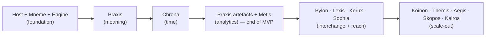

# Module delivery order

Why the modules ship in the order they do — the dependency rationale behind the milestone sequence, the critical path through it, and what each delivered module unlocks. For a reader who has seen the milestone table in the [roadmap](../00-index/ROADMAP.md) and wants to know _why_ the order is the only safe one, not _what_ the milestones contain.

This document is the _why_. The milestone table, the MVP definition, and the per-milestone exit criteria live in the [roadmap](../00-index/ROADMAP.md) and are not repeated here; the authoritative dependency graph the order rests on is the [module dependency map](../01-architecture/module-dependency-map.md).

---

## The order is forced, not chosen

The delivery order is not a product-priority preference that could be reshuffled by demand. It is **forced by the acyclic engine dependency graph** ([module dependency map](../01-architecture/module-dependency-map.md)): a module can be built only after everything it depends on can carry it, because a module that reads through Mneme cannot be exercised before Mneme stores anything, and a module that maps onto the metamodel cannot be exercised before Praxis defines one. The graph is acyclic by construction ([ADR-0011](../06-adrs/ADR-0011-module-taxonomy-and-boundaries.md)), so it admits a topological order; the milestone sequence _is_ that topological order, grouped into capability gates.

Naming the consequence: because the order follows dependencies, it cannot be accelerated by working harder on a later module. Building Sophia before Praxis validates against the metamodel would produce Generated suggestions with nothing well-formed to suggest against. The sequence is a constraint the architecture imposes, and the trade-off it accepts is that a high-demand later capability still waits for its foundation.

---

## The critical path

One chain runs the length of the build, and every other module hangs off a point on it. This is the critical path — the longest dependency chain, the one that fixes the earliest each downstream module can begin.

_Figure 1 — The critical path. Each stage can begin only when the stage to its left satisfies its exit criteria ([roadmap](../00-index/ROADMAP.md)). Modules within a stage parallelise; the stages themselves are ordered._

The path reads as four claims about what must be true before the next thing is possible:

- **Storage and the boundary come first** because every engine reads and writes through Mneme ([module dependency map](../01-architecture/module-dependency-map.md), allowed edges) and every renderer call crosses the host trust boundary ([ADR-0006](../06-adrs/ADR-0006-tauri-trust-boundary-and-typed-ipc.md)). Nothing can be exercised against a twin that cannot yet store or guard one.
- **Meaning comes before time and analytics** because Chrona consumes Praxis contract types ([module dependency map](../01-architecture/module-dependency-map.md)) and Metis reads projections of a graph whose types Praxis defines. Time-travel and centrality over an untyped store would have nothing to resolve or rank.
- **The single-user core completes before anything multi-user or assistive** because collaboration, governance, AI assistance, and automated discovery all presuppose a twin that one user can already author, time-travel, and reason over. The MVP boundary is drawn exactly here ([roadmap](../00-index/ROADMAP.md), MVP).
- **Interchange precedes reach and scale-out** because Pylon and Skopos both write through the canonical op-log path the foundation established, and the reach modules (search, reporting, AI) operate over content that import and authoring have put there.

---

## What each delivery unlocks

The order is best understood as a chain of unlocks: each delivered module removes a blocker for the next. The table reads the [roadmap](../00-index/ROADMAP.md) milestones as enablement edges rather than as dates.

| When this lands                                           | It unlocks                                                                                   | Because                                                                                                                                                                                                                                                      |
| --------------------------------------------------------- | -------------------------------------------------------------------------------------------- | ------------------------------------------------------------------------------------------------------------------------------------------------------------------------------------------------------------------------------------------------------------ |
| **Host + Mneme + Engine** (foundation)                    | Every engine that reads or writes the twin.                                                  | Engines depend on Mneme's storage facade and attach via the `engine` harness ([module dependency map](../01-architecture/module-dependency-map.md)).                                                                                                         |
| **Praxis** (meaning)                                      | Time resolution, analytics, artefacts, and every importer's mapping target.                  | Chrona, Metis, and Pylon all consume Praxis contract types or map onto the metamodel it owns.                                                                                                                                                                |
| **Chrona** (time)                                         | Viewpoint-stamped artefacts, diff, scenario comparison, and viewpoint-stamped export.        | A result, an export, or a diff is meaningless without the as-of valid time, layer policy, and scenario Chrona resolves ([ADR-0009](../06-adrs/ADR-0009-temporal-model-valid-interval-layer-policy-viewpoint.md)).                                            |
| **Praxis artefacts + Metis** (analytics) — MVP            | A usable product: a single architect can author, time-travel, and reason over a twin.        | This is the MVP exit; everything after it is additive ([roadmap](../00-index/ROADMAP.md)).                                                                                                                                                                   |
| **Pylon + Continuum** (interchange)                       | Seeding a twin at scale from existing models; the reach modules then have content to act on. | Deterministic, reviewable import lands facts through the op log; durable jobs survive restart ([deterministic-reviewable-import](../05-modules/pylon/deterministic-reviewable-import.md), [ADR-0018](../06-adrs/ADR-0018-idempotency-and-deduplication.md)). |
| **Lexis + Kerux + Sophia** (reach)                        | Finding, publishing, and AI-assisted authoring over the populated twin.                      | Each operates over authored or imported content and classifies its output honestly (Sophia's is Generated — [ADR-0014](../06-adrs/ADR-0014-ai-assistance-and-generated-provenance-sophia.md)).                                                               |
| **Koinon + Themis + Aegis + Skopos + Kairos** (scale-out) | Multi-user, governed, continuously-synced, investment-planned operation.                     | These presuppose the single-user core and the interchange path; Skopos keeps `actual` fresh by reconciliation ([ADR-0032](../06-adrs/ADR-0032-automated-discovery-reality-sync-skopos.md)), feeding Kairos.                                                  |

---

## Where the order has slack

Not every edge is on the critical path; within a stage, modules that share no dependency edge are built in parallel, and the order between them is free.

- **Within the reach stage**, Lexis, Kerux, and Sophia each read through Mneme and depend on no other engine ([module dependency map](../01-architecture/module-dependency-map.md)); their relative order is a product-priority call, not a dependency one.
- **Pylon and Skopos are independent of each other** ([Skopos vs Pylon](../05-modules/skopos/vs-pylon.md)) — they share no machinery beyond the canonical write path — so Skopos's scale-out placement reflects its reliance on the established reconciliation discipline and Continuum scheduling, not a dependency on Pylon.
- **Kairos depends on Skopos as its entropy feeder** ([entropy-feeder-for-kairos](../05-modules/skopos/entropy-feeder-for-kairos.md)), which is why both sit in the final stage; Kairos cannot detect drift from a fresh `actual` layer that nothing keeps fresh.

The slack is real but bounded: it exists _within_ a stage, never _across_ one. A reach module cannot jump ahead of the MVP, and a scale-out module cannot precede the interchange path it builds on.

---

## References & standards

_Informative:_

- **arc42** template — the building-block dependency view this ordering rests on.

Full bibliography: [`../02-standards/STANDARDS-REGISTER.md`](../02-standards/STANDARDS-REGISTER.md).

## Related documents

| Document                                                             | What it covers                                                              |
| -------------------------------------------------------------------- | --------------------------------------------------------------------------- |
| [Roadmap and build sequence](../00-index/ROADMAP.md)                 | The milestone table, MVP definition, and per-milestone exit criteria.       |
| [Module dependency map](../01-architecture/module-dependency-map.md) | The authoritative acyclic engine graph this order is a topological sort of. |
| [Module map](./module-map.md)                                        | The implemented-vs-planned split and per-module ownership.                  |
| [ADR-0011](../06-adrs/ADR-0011-module-taxonomy-and-boundaries.md)    | The module taxonomy and the acyclic-graph invariant.                        |
| [Skopos vs Pylon](../05-modules/skopos/vs-pylon.md)                  | Why the two interchange modules are independent.                            |
