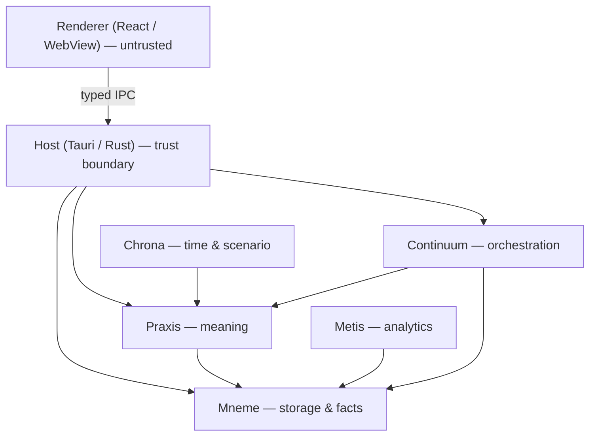

# Module Map

How the product is decomposed into modules and how the renderer reaches them. This document gives the product-layer reading of the module pantheon; the authoritative taxonomy, boundary rules, and the acyclic engine graph are fixed by [ADR-0011](../06-adrs/ADR-0011-module-taxonomy-and-boundaries.md) and the [architecture boundary](../01-architecture/ARCHITECTURE-BOUNDARY.md). Module names and roles follow the [Documentation Standard §10](../02-standards/DOCUMENTATION-STANDARD.md) pantheon and are not redefined here.

---

## The renderer reaches engines only through the host

_The renderer crosses the trust boundary by typed IPC only; engines compose behind the host with no engine-to-engine cycles (axiom 6, [design-axioms.md](./design-axioms.md))._

## Implemented modules

These have crates today. Full per-module design lives under [05-modules/](../05-modules/).

| Module        | Role                                                                                                                | Module doc                                     |
| ------------- | ------------------------------------------------------------------------------------------------------------------- | ---------------------------------------------- |
| **Praxis**    | Metamodel, types, edge catalogue, tasks, artefact execution, integrity scoring, explainability.                     | [praxis](../05-modules/praxis/README.md)       |
| **Mneme**     | Op log, bitemporal facts, schema-as-data, blob store, derived runtime, engine trait.                                | [mneme](../05-modules/mneme/README.md)         |
| **Metis**     | Deterministic, bounded graph analytics — centrality, impact, paths, cost. Owns [analytics/](./analytics/README.md). | [metis](../05-modules/metis/README.md)         |
| **Chrona**    | Viewpoint resolution, layer policy, diff, scenario composition, temporal UX.                                        | [chrona](../05-modules/chrona/README.md)       |
| **Continuum** | Local durable orchestration — jobs, retries, schedules, run ledger.                                                 | [continuum](../05-modules/continuum/README.md) |
| **Host**      | The Tauri trust boundary — typed IPC, capabilities, workspace lifecycle, OS integration, event bus.                 | [host](../05-modules/host/README.md)           |
| **Engine**    | The shared engine harness wiring the domain engines behind their traits for the host.                               | [engine](../05-modules/engine/README.md)       |

## Planned modules

Documented as design intent and labelled _planned_ until a crate exists ([Documentation Standard §10](../02-standards/DOCUMENTATION-STANDARD.md)). The product areas in this layer name these as the owners of work that is not yet built; each README states the boundary it will occupy and the ADR that introduces it.

| Module     | Role (design intent)                                                                                                                                    | Introduced by                                                                    |
| ---------- | ------------------------------------------------------------------------------------------------------------------------------------------------------- | -------------------------------------------------------------------------------- |
| **Kairos** | Investment and portfolio/programme/project planning, driven by entropy and action. The engine behind [forces-of-change/](./forces-of-change/README.md). | [ADR-0028](../06-adrs/ADR-0028-investment-and-portfolio-planning-kairos.md)      |
| **Lexis**  | Bounded, viewpoint-aware search and discovery — full-text and semantic retrieval.                                                                       | [ADR-0012](../06-adrs/ADR-0012-search-and-discovery-lexis.md)                    |
| **Pylon**  | Interchange — file/manual import/export and connectors (ArchiMate Open Exchange, CSV/Excel).                                                            | [ADR-0013](../06-adrs/ADR-0013-interchange-and-interoperability-pylon.md)        |
| **Skopos** | Automated discovery / reality-sync — continuous ingestion to keep the `actual` layer fresh; the entropy feeder for Kairos.                              | [ADR-0032](../06-adrs/ADR-0032-automated-discovery-reality-sync-skopos.md)       |
| **Sophia** | AI assistance — LLM-assisted authoring and enrichment behind centralised guardrails; all output Generated.                                              | [ADR-0014](../06-adrs/ADR-0014-ai-assistance-and-generated-provenance-sophia.md) |
| **Kerux**  | Reporting and publishing — deterministic briefings, roadmaps, packaged outputs with redaction by default.                                               | [ADR-0015](../06-adrs/ADR-0015-reporting-and-publishing-kerux.md)                |
| **Koinon** | Collaboration — sync, presence, shared workspace, merge/conflict UX.                                                                                    | [ADR-0029](../06-adrs/ADR-0029-collaboration-and-sync-koinon.md)                 |
| **Themis** | Governance — identity, RBAC, approvals, retention, audit, capability policy. Underpins the Steward participation mode.                                  | [ADR-0030](../06-adrs/ADR-0030-governance-themis.md)                             |
| **Aegis**  | Risk, controls, and compliance — a risk register and control library mapped onto the twin.                                                              | [ADR-0031](../06-adrs/ADR-0031-risk-controls-compliance-aegis.md)                |

Some concerns are real but do not yet earn a module and are folded into an existing one with an explicit split-out trigger: **Oikos** (run-cost/FinOps, in Metis + Kairos), **Krisis** (validation and data-quality, in Praxis integrity scoring), **Topos** (auto-layout, in the renderer + Praxis), **Logos** (narrative and rationale, in Kerux + Mneme). See [Documentation Standard §10](../02-standards/DOCUMENTATION-STANDARD.md) and [ADR-0011](../06-adrs/ADR-0011-module-taxonomy-and-boundaries.md).

## Where ownership lands in this layer

| Product concern                      | Owning module(s)                                                                                                                               |
| ------------------------------------ | ---------------------------------------------------------------------------------------------------------------------------------------------- |
| Artefact identity and execution      | Praxis                                                                                                                                         |
| Analytics, scores, impact, signals   | Metis (with Kairos and Aegis as planned signal producers — [signal-surfaces/ownership-by-module.md](./signal-surfaces/ownership-by-module.md)) |
| Time, scenario, diff                 | Chrona                                                                                                                                         |
| Accepted work, schedules, automation | Continuum                                                                                                                                      |
| Shell rendering, IPC, capabilities   | Host                                                                                                                                           |
| LLM assistance                       | Sophia (planned)                                                                                                                               |
| Governance and the Steward mode      | Themis (planned)                                                                                                                               |

## Related documents

| Document                                                                                | What it covers                                         |
| --------------------------------------------------------------------------------------- | ------------------------------------------------------ |
| [01-architecture/module-dependency-map.md](../01-architecture/module-dependency-map.md) | The authoritative module dependency graph.             |
| [01-architecture/ARCHITECTURE-BOUNDARY.md](../01-architecture/ARCHITECTURE-BOUNDARY.md) | The boundary rules and typed seams.                    |
| [Documentation Standard §10](../02-standards/DOCUMENTATION-STANDARD.md)                 | The naming pantheon and the earns-its-own-module test. |
| [ADR-0011](../06-adrs/ADR-0011-module-taxonomy-and-boundaries.md)                       | The module taxonomy decision.                          |
