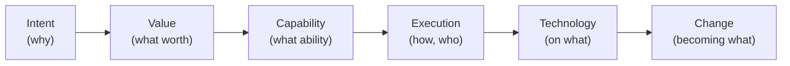

# The spine

The semantic spine is the lineage **Intent → Value → Capability → Execution → Technology → Change**. This file states
what the lineage is, why it exists, and what depends on it. For a reader who needs the concept before the mappings.

---

## The lineage

The spine is the expected line of reasoning from why an organisation acts to how a change reshapes it:

_The semantic spine: the strategy-to-execution lineage Aideon reasons along._

Each role answers one question, and each link is an expectation about how the twin should hang together:

| Role           | The question it answers                                       |
| -------------- | ------------------------------------------------------------- |
| **Intent**     | Why does the organisation act? (drivers, goals)               |
| **Value**      | What worth is sought, and for whom? (outcomes, value streams) |
| **Capability** | What ability is needed to produce that value?                 |
| **Execution**  | How, and by what process, is the capability exercised?        |
| **Technology** | On what applications and platforms does execution run?        |
| **Change**     | How is the organisation planned to become different?          |

---

## Why the spine exists

The spine exists so that the twin can be reasoned about as a _connected argument_, not a bag of disconnected elements.
Three things depend on it ([DESIGN.md](../DESIGN.md), _Semantic spine_):

- **Integrity scoring.** A gap along the spine — a capability that serves no value, an application that realises no
  capability — lowers an entity's [integrity score](../../02-standards/DOCUMENTATION-STANDARD.md) (§8.1). The spine is
  the expectation the **Completeness** and **Connectivity** dimensions measure against
  ([how the spine drives integrity and explainability](./how-the-spine-drives-integrity-and-explainability.md)).
- **Bounded traversal defaults.** When an artefact traverses the graph, the spine sets sensible default directions and
  depths, so a "why does this matter?" query walks _up_ the spine and an impact query walks _down_ it.
- **Explainability.** The spine is the path an explanation follows. "Why does Customer Insight matter?" is answered by
  tracing from the capability up toward the value and intent it serves; "what does this technology affect?" by tracing
  down toward the applications and capabilities it hosts.

The spine is **not a UI flow** and not a wizard. It is a semantic expectation about structure, used by reasoning, not a
sequence a user steps through.

---

## The spine is normative design, not fully seeded

Honesty requires the distinction be kept in view throughout. The spine is **normative** — it defines what _should_
connect to what — but the seed metamodel realises only part of it. The seed has strong types for Capability, Execution,
Technology, and Change, a partial expression of Value (`ValueStreamStage`), and **no** type for Intent. The role-by-role
implemented-vs-planned account is [spine-to-seed types](./spine-to-seed-types.md), and the ArchiMate/TOGAF mapping is
[spine-to-ArchiMate mapping](./spine-to-archimate-mapping.md).

The trade-off this framing accepts: the spine asks for more structure than the seed currently provides, so today's
integrity scores will record genuine gaps at the Intent and Value ends. That is the intended behaviour — the score tells
the truth about an incomplete model rather than lowering the bar to match what is built.

---

## References & standards

_Normative:_

- The Open Group — **TOGAF Standard, 10th Edition**. The strategy-to-execution lineage the spine encodes (ADM phases
  A→F).
- The Open Group — **ArchiMate 3.2 Specification**. The layered element model the roles map onto.

_Informative:_

- Christensen; Ulwick — **Jobs-to-be-Done**. Framing each role by the question it answers.

## Related documents

| Document                                                                                                    | What it covers                               |
| ----------------------------------------------------------------------------------------------------------- | -------------------------------------------- |
| [Spine to ArchiMate mapping](./spine-to-archimate-mapping.md)                                               | Each role → ArchiMate layer and TOGAF phase. |
| [Spine to seed types](./spine-to-seed-types.md)                                                             | What is implemented vs PLANNED.              |
| [How the spine drives integrity and explainability](./how-the-spine-drives-integrity-and-explainability.md) | The scoring and explanation link.            |
| [DESIGN.md](../DESIGN.md)                                                                                   | The product framing of the spine.            |
