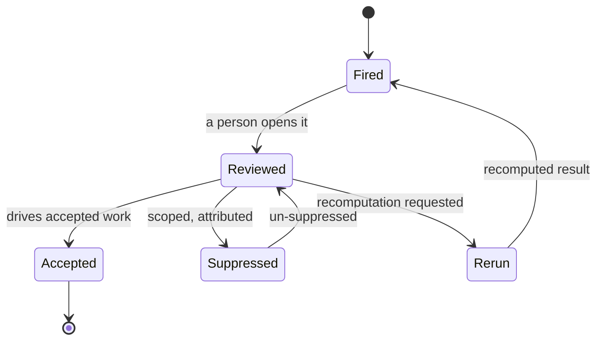

# Suppression and lifecycle

How a signal moves from firing to a resolved disposition, and how suppression works as a first-class, attributable action. The governing constraint: signals never silently update, and recomputation is always explicit.

---

## The lifecycle

A signal has a small, explicit lifecycle. Every transition is a recorded event; none happens silently.

_Figure: the signal lifecycle. A signal never resolves itself; each transition is a human action or an explicit recomputation._

- **Fired** — the producing module emitted the signal with all [six required elements](./required-elements.md).
- **Reviewed** — a person has opened it; the signal is not yet disposed.
- **Accepted** — the user acts on it. Acceptance may drive accepted work into the model (an Asserted operation, attributed to the person) or open a review task. The signal itself never writes truth ([authority-rule.md](./authority-rule.md)).
- **Suppressed** — the user hides it under the rules below.
- **Rerun** — the user requests recomputation; the producing module recomputes and the signal re-fires with a fresh result.

## Suppression is a first-class action

Suppressing a signal is an action the system records, not a quiet dismissal. Suppression **must**:

- **be logged and attributed** — who suppressed it, when, and (optionally) why;
- **be scopeable** — to this entity, this artefact, this signal type, or a named scope;
- **be time-boundable** — until a date, or until a stated condition recurs;
- **be reversible** — a suppressed signal can be un-suppressed, returning it to review.

Suppression **must not** be silent and **must not** delete the signal's history. A suppressed signal is hidden from the active surface, not erased; its record remains auditable. This keeps suppression honest: a reviewer can always see what was hidden, by whom, and for how long.

## Signals never silently update

When the underlying model changes, an existing signal does **not** quietly re-score or rewrite itself. It instead enters a **Stale** result state (§9), and a **rerun** action becomes available. Recomputation is explicit — triggered by the user or by an [Continuum](../../05-modules/continuum/README.md)-scheduled job — never an invisible in-place edit. This is the surface-level form of the same honesty rule that governs artefact results: a derived output that may have moved says so rather than presenting a possibly-wrong current value as fresh.

The trade-off is deliberate: the user may see a Stale signal for a while rather than an automatically-refreshed one. That is the cost of never showing a silent, unattributed change as if it were current truth.

## Worked example

Metis fires a concentration warning on `Insight Hub` (`n:application:insight-hub`). An architect reviews it and judges the concentration acceptable for now, so they **suppress** it scoped to `Insight Hub`, time-bounded to the end of the `FY26 Insight Modernization` plan (`n:plan-event:fy26-modernization`), with the note "revisit after modernisation". The suppression is logged against the architect. When a later change adds a new `hosts` relationship to `Insight Hub`, the warning's inputs change: it does not silently re-appear or re-score; it goes **Stale** and offers a **rerun**. After the time bound lapses, the suppression ends and the signal returns to review.

## References & standards

_Informative:_

- Nielsen — **10 Usability Heuristics**, 1994 (visibility of system status; user control and freedom). Recorded in the [standards register](../../02-standards/STANDARDS-REGISTER.md).

## Related documents

| Document                                                                  | What it covers                                                     |
| ------------------------------------------------------------------------- | ------------------------------------------------------------------ |
| [authority-rule.md](./authority-rule.md)                                  | Why a signal never resolves itself or commits truth on acceptance. |
| [required-elements.md](./required-elements.md)                            | Suppress, accept, and rerun as required valid actions.             |
| [integration-with-artefacts.md](./integration-with-artefacts.md)          | How freshness and Stale state are shown on the surface.            |
| [DOCUMENTATION-STANDARD.md](../../02-standards/DOCUMENTATION-STANDARD.md) | Result states (§9): Fresh, Stale, Rebuilding, and the rest.        |
