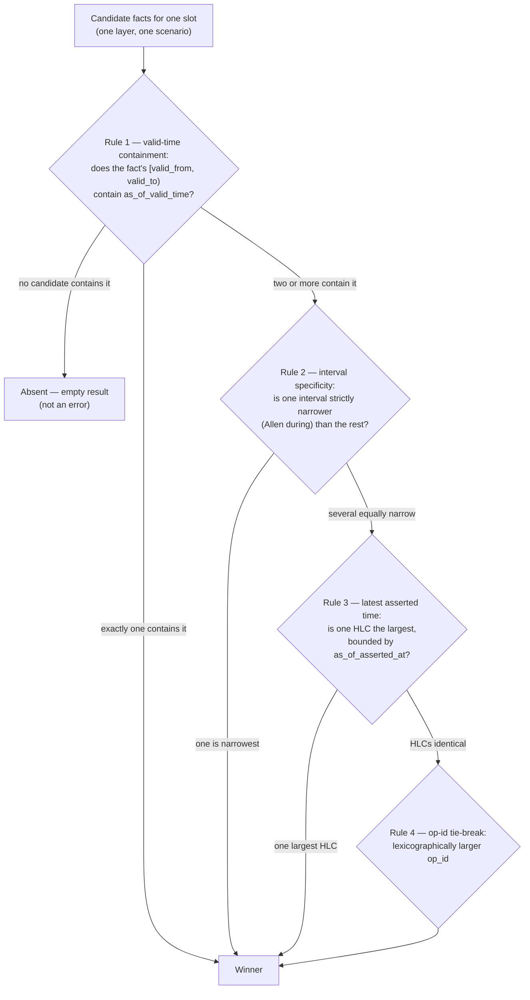

# Temporal resolution rules

How the resolver picks a single winning value among competing facts for one slot at a given as-of valid time, **within a
single layer**. Cross-layer combination is governed by the viewpoint's [layer policy](./layer-and-policy.md), not by
this chain.

---

## The precedence chain

When multiple candidate facts compete for the same resolved slot at a given as-of valid time within a layer, the
resolver applies this chain in order and stops at the first rule that selects a unique winner.

| Priority | Rule                       | Detail                                                                                                                                                                             |
| -------- | -------------------------- | ---------------------------------------------------------------------------------------------------------------------------------------------------------------------------------- |
| 1        | **Valid-time containment** | Only facts whose valid-time interval `[valid_from, valid_to)` contains (or aligns with) the requested `as_of_valid_time` are candidates.                                           |
| 2        | **Interval specificity**   | A narrower valid-time interval wins over a wider one. A fact valid for one day is preferred over one valid for a year (a null `valid_to` is the widest).                           |
| 3        | **Latest asserted time**   | Among remaining ties, the fact with the largest HLC value wins (most-recently asserted), bounded by the viewpoint's `as_of_asserted_at`. See [hlc-encoding.md](./hlc-encoding.md). |
| 4        | **Op-id tie-break**        | If asserted HLCs are identical, the fact with the lexicographically larger operation identifier wins. Degenerate in practice but must be deterministic.                            |

**Tombstones and overrides** enter the same pipeline — a tombstone within a layer with a later asserted time suppresses
an earlier fact in that layer by the same rules.

**No fact wins by default.** If no candidate survives the containment filter for the requested as-of valid time, the
resolver returns an empty/absent result for that slot. Absence is not an error.

## The decision tree for overlapping facts

When several facts' valid-time intervals overlap at the requested instant, the chain is a decision tree: each rule
partitions the surviving candidates and the resolver descends only while more than one candidate remains. The first rule
that leaves exactly one candidate decides the slot; rules below it are never consulted. The tree is total — every input
reaches a single leaf — because rule 4 is defined on a totally ordered key (the `op_id`), so there is always a unique
winner unless the candidate set is empty.



_Figure: the resolution chain as a decision tree; each rule is consulted only while more than one candidate survives the
one above it._

Three properties make the tree safe to depend on:

- **It descends, never restarts.** A lower rule only ever sees the candidates a higher rule could not separate; it
  cannot re-admit a fact the containment filter already excluded.
- **It is deterministic.** Every rule below containment compares a totally ordered key — interval width (by Allen's
  `during` relation), then HLC (a single `i64`, see [hlc-encoding.md](./hlc-encoding.md)), then `op_id` lexical order.
  The same candidate set always reaches the same leaf.
- **The asserted bound applies before rule 3, not after.** Rule 3 only ranks facts whose HLC is at or below the
  viewpoint's `as_of_asserted_at`; a fact asserted after the pinned belief is not a candidate at all (see the "latest"
  filter below). On a read that omits `as_of_asserted_at`, the bound is the latest assertion and every fact is in range.

### Worked example — three overlapping intervals

Extending the seed example: `cap_payments.tier` now carries three competing facts in the `actual` layer, baseline
scenario.

| Fact | Value      | Valid interval             | Asserted (HLC) |
| ---- | ---------- | -------------------------- | -------------- |
| f1   | `tier = 2` | `[2026-01-01, null)`       | `…+0`          |
| f2   | `tier = 1` | `[2026-06-01, 2026-09-01)` | `…+5`          |
| f3   | `tier = 3` | `[2026-06-01, 2026-09-01)` | `…+9`          |

Viewpoint: `as_of_valid_time.instant = 2026-06-10T09:00:00Z`, `layer = "actual"`, latest belief, no scenario. Descending
the tree:

1. **Rule 1 — containment.** All three contain 10 June (f1 open-ended from January; f2 and f3 across June–September).
   Three candidates survive.
2. **Rule 2 — interval specificity.** f2 and f3 are both `during` f1's open-ended interval (by Allen), so each is
   strictly narrower than f1; f1 is eliminated. f2 and f3 have **identical** intervals, so specificity cannot separate
   them. Two candidates survive.
3. **Rule 3 — latest asserted time.** f3's HLC (`…+9`) exceeds f2's (`…+5`); both are at or below the latest belief. f3
   wins.

Result: `tier = 3`, **Asserted** content, effective interval `[2026-06-01, 2026-09-01)`; result-state **Fresh**
([honest-state, §9](../../02-standards/DOCUMENTATION-STANDARD.md)). Rule 4 is never reached because rule 3 already left
one candidate. f1 and f2 are not deleted — they are outranked, and remain inspectable in provenance
([conflicts-during-resolution.md](./conflicts-during-resolution.md)).

## The resolution algorithm (language-neutral)

The decision tree above is the shape; this is the procedure, written as numbered steps with no language binding so any
implementation — Rust, TypeScript, or a test oracle — runs the same logic and the
[resolution vectors](../../data/fixtures/temporal/README.md) exercise it identically. It deepens the tree, it does not
restate it: the tree shows _which_ rule decides; this shows _how_ a read is assembled around that rule, including the
layer-policy and scenario-overlay wrappers the tree omits.

The procedure resolves **one slot** at **one viewpoint**. Inputs: the slot's candidate operations (each carrying
`value`, `layer`, `scenario`, `[valid_from, valid_to)`, `asserted_hlc`, `op_id`, and whether it is a tombstone) and the
viewpoint (`as_of_valid_time`, `as_of_asserted_at`, `layer`, `scenario`).

```text
RESOLVE-SLOT(operations, viewpoint) -> result:

1. SCENARIO COMPOSITION (outermost)
   a. baseline := RESOLVE-LAYERS(operations where scenario = baseline, viewpoint)
   b. if viewpoint.scenario is absent: result := baseline; go to 7
   c. overlay := RESOLVE-LAYERS(operations where scenario = viewpoint.scenario, viewpoint)
   d. if the overlay produced a value (including a scenario tombstone):
         result := overlay            # overlay replaces baseline for this slot
      else:
         result := baseline           # pass-through: no scenario fact for this slot
   e. go to 7

2. RESOLVE-LAYERS(ops, viewpoint):                 # the layer-policy wrapper
   - if viewpoint.layer is a single layer name L:
        return RESOLVE-WITHIN-LAYER(ops where layer = L, viewpoint)
   - if viewpoint.layer is { policy: "actual_over_plan" }:
        a := RESOLVE-WITHIN-LAYER(ops where layer = "actual", viewpoint)
        p := RESOLVE-WITHIN-LAYER(ops where layer = "plan",   viewpoint)
        return a if a is present, else p             # higher layer overrides where it exists
   - if viewpoint.layer is { policy: "side_by_side" }:
        return { actual: RESOLVE-WITHIN-LAYER(ops actual, viewpoint),
                 plan:   RESOLVE-WITHIN-LAYER(ops plan,   viewpoint) }   # both kept

3. RESOLVE-WITHIN-LAYER(ops, viewpoint):            # the precedence chain (rules 1-4)
   a. ASSERTED BOUND: if viewpoint.as_of_asserted_at = H is set,
         discard every op whose asserted_hlc > H.   # filter BEFORE ranking (not after)
   b. CONTAINMENT (rule 1): keep ops whose [valid_from, valid_to) contains
         as_of_valid_time. A point at the exclusive valid_to is NOT contained.
         if none remain: return ABSENT (not an error).
   c. if exactly one remains: it wins; return it (deciding rule = containment).
   d. SPECIFICITY (rule 2): among survivors, keep those whose interval is
         strictly narrowest (Allen `during` the others; null valid_to is widest).
         if exactly one remains: it wins (deciding rule = specificity).
   e. LATEST HLC (rule 3): among survivors, keep those with the maximum asserted_hlc.
         if exactly one remains: it wins (deciding rule = latest asserted time).
   f. OP-ID TIE-BREAK (rule 4): the survivor with the lexicographically largest
         op_id wins (deciding rule = op-id tie-break; flag CONFLICT-RESOLVED,
         result-state = Awaiting review).
   g. a tombstone that wins any of c-f yields ABSENT for the slot (supersession,
         not erasure): the suppressed ops stay in history and are returned by an
         explained read.

4. MULTI-VALUED SLOTS: if the slot is multi-valued, steps 3c-3f do not pick one
   winner. Instead, after the asserted bound (3a) and containment (3b), return the
   set of all surviving members that are not superseded by a later same-member
   tombstone. Each member is resolved on the asserted axis independently.

5. (reserved)

6. (reserved)

7. RESULT: a present value (or value set, or per-layer pair for side_by_side) with
   its effective interval (the span the winner actually holds, <= its stored
   interval, narrowed by any more-specific competing interval), its content
   classification (Asserted / Inferred / ...), its result-state (Fresh, or
   Awaiting review when conflict-resolved), the deciding rule, and the superseded
   candidates with why each lost. ABSENT is a valid, non-error result.
```

Two invariants make the procedure safe to depend on, matching the decision-tree properties above: the chain (step 3)
**descends and never restarts** — a lower rule only sees what a higher rule could not separate — and it is **total**,
because step 3f compares a totally ordered key, so a non-empty candidate set always reaches exactly one leaf. The
scenario (step 1) and layer (step 2) wrappers compose _over_ the chain; they never reorder it. A diff resolves two
viewpoints by this same procedure and derives its delta kind from which coordinates differ ([diff.md](./diff.md)).

## The "latest" filter and pinned belief

The asserted-time axis offers two read modes, governed by whether the viewpoint pins `as_of_asserted_at`:

| Mode                 | Viewpoint                   | Candidate set on the asserted axis                                                                      |
| -------------------- | --------------------------- | ------------------------------------------------------------------------------------------------------- |
| **Latest** (default) | `as_of_asserted_at` omitted | Every fact, regardless of when it was asserted. Rule 3 ranks by raw HLC; the most recent belief wins.   |
| **As-of a belief**   | `as_of_asserted_at = H`     | Only facts whose HLC ≤ `H`. A fact asserted after `H` is excluded **before** the precedence chain runs. |

"Latest" is not a fact attribute; it is the absence of an upper bound on the asserted axis
([viewpoint-shape.md](./viewpoint-shape.md), asserted-time default). The distinction is load-bearing: asking for the
latest asserted value answers _what do we believe now?_, while pinning `as_of_asserted_at` replays _what did we believe
at that instant?_ — the basis for belief diffs ([diff.md](./diff.md)).

In the three-fact example above, pinning `as_of_asserted_at` to a value below f3's HLC removes f3 from the candidate set
entirely; the tree then resolves f2 (`tier = 1`) by rule 3 over the remaining {f1, f2}. Pinning below f2's HLC as well
leaves only f1 (`tier = 2`) — the belief before either correction landed. The filter changes the candidate set, never
the precedence among the candidates that remain.

## Allen interval algebra

Containment and specificity (priorities 1–2) are decided with the thirteen interval relations of Allen's interval
algebra (Allen, _Maintaining Knowledge about Temporal Intervals_, 1983). For a point read (`as_of_valid_time.instant`),
a fact is a candidate when the instant falls inside its half-open interval — Allen's `during`, `starts`, or `finishes`
relative to the fact, treating the instant as a degenerate interval. For a range read (`as_of_valid_time.interval`),
candidacy and specificity use the full relation set: `equals`, `during`, `contains`, `overlaps`, `starts`, `finishes`,
and their inverses. Specificity prefers the fact whose interval is `during` (contained by) the others — the narrowest
claim that still covers the request.

## Worked example

Using the seed metamodel ([`core-v1.json`](../../data/meta/core-v1.json)): a `Capability` entity `cap_payments` carries
a `tier` slot.

Starting facts (all in the `actual` layer, baseline scenario):

| Fact | Value      | Valid interval             | Asserted (HLC) |
| ---- | ---------- | -------------------------- | -------------- |
| f1   | `tier = 2` | `[2026-01-01, null)`       | `…+0`          |
| f2   | `tier = 1` | `[2026-06-01, 2026-09-01)` | `…+5`          |

Viewpoint: `as_of_valid_time.instant = 2026-06-10T09:00:00Z`, `layer = "actual"`, no scenario.

Resolution, step by step:

1. **Containment** — both f1 (open-ended from January) and f2 (June–September) contain 10 June. Two candidates remain.
2. **Interval specificity** — f2's interval (`during` f1's, by Allen) is narrower than f1's open-ended one. f2 wins.

Result: `tier = 1`, **Asserted** content (no analytics derived it), with an **effective interval** of
`[2026-06-01, 2026-09-01)` — narrower than f2's stored interval only if a still-narrower competing fact existed; here it
equals it. The result-state is **Fresh** when read against current canonical material
([honest-state, §9](../../02-standards/DOCUMENTATION-STANDARD.md)).

Had the viewpoint instead pinned `as_of_asserted_at` to a value below f2's HLC, f2 would not yet be a candidate and the
resolver would return `tier = 2` — the belief before f2 was asserted.

## References & standards

- Allen — **Maintaining Knowledge about Temporal Intervals**, 1983 _(normative: interval relations)_.
- Snodgrass — _Developing Time-Oriented Database Applications in SQL_, 1999 _(normative: sequenced resolution
  semantics)_.

## Related documents

| Document                                                                        | What it covers                                                                 |
| ------------------------------------------------------------------------------- | ------------------------------------------------------------------------------ |
| [layer-and-policy.md](./layer-and-policy.md)                                    | The cross-layer policy that composes over this within-layer chain.             |
| [explainability.md](./explainability.md)                                        | How a read returns the rule that selected each winner.                         |
| [conflicts-during-resolution.md](./conflicts-during-resolution.md)              | Effective state when facts genuinely conflict, and superseded-fact visibility. |
| [Chrona: viewpoint resolution](../../05-modules/chrona/viewpoint-resolution.md) | The engine that runs this chain.                                               |
| [Temporal resolution vectors](../../data/fixtures/temporal/README.md)           | The M2 oracle that exercises the language-neutral algorithm above.             |
| [`CONTEXT.md`](../../../CONTEXT.md)                                             | The _effective interval_ definition this example follows.                      |
