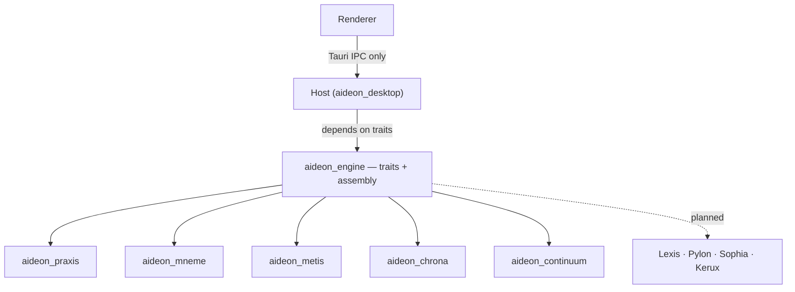

# Engine — the engine harness

The `engine` crate (`aideon_engine`) is the shared engine harness: it wires each domain engine behind its trait so the host's IPC handlers depend on trait objects, not concrete types. It is the composition root for engines — the seam that lets the host be the composition root without depending on any engine's concrete type. It is **not** a domain engine and holds no domain invariant of its own.

This README is the design record for the harness. Its role and its place in the dependency graph are fixed by [ADR-0011](../../06-adrs/ADR-0011-module-taxonomy-and-boundaries.md) and drawn in the [module dependency map](../../01-architecture/module-dependency-map.md).

> **Implementation status.** The `engine` crate exists in the workspace but is currently unpopulated. The wiring role, the trait-object contract, and the attachment rules below are **design intent** — the specification the harness is built to — labelled as such where they describe behaviour not yet in code. The acyclicity and composition rules are normative now and constrain the implementation when it lands.

---

## One-line responsibility

The harness binds each concrete engine implementation to its published trait and produces the set of trait objects the host routes IPC commands and jobs to — so a handler never names a concrete engine.

---

## Why the harness exists

The host (`desktop`) is the composition root: it composes cross-engine work, and engines do not depend on one another ([dependency rules](../../01-architecture/boundary/dependency-rules.md)). For the host to compose engines without depending on their concrete types, something must hold the trait definitions the host programmes against and the assembly logic that binds each concrete engine to its trait. That something is the `engine` harness.

The arrangement that results:

- the **host** depends on `engine`'s **traits**;
- `engine` depends on the **concrete** engine crates (`praxis`, `mneme`, `metis`, `chrona`, `continuum`, and later the planned engines);
- a host IPC handler **never names a concrete engine** — it routes to a trait object.

This is the indirection that makes every engine replaceable: swapping a Praxis or Mneme implementation, or replacing the storage engine, changes the binding inside the harness and nothing in the host's handlers ([dependency rules](../../01-architecture/boundary/dependency-rules.md), [ADR-0004](../../06-adrs/ADR-0004-storage-engine-abstraction.md)).



_Figure 1 — The harness sits between the host and the concrete engines in the wiring direction: the host depends on its traits, it depends on the concrete crates, and no engine depends on the harness._

---

## The invariants

- **The harness composes engines; it does not couple them.** Because `engine` sits between the host and the domain crates in the wiring direction, it must not become a back-channel for engine-to-engine coupling. It assembles engines behind traits; it does not let them import one another ([module dependency map](../../01-architecture/module-dependency-map.md)).
- **No engine depends on the harness.** The dependency is one-directional: `engine` depends on the concrete engines, never the reverse. An engine that imported the harness would invert the composition direction ([dependency rules](../../01-architecture/boundary/dependency-rules.md)).
- **The harness holds no domain invariant.** It owns no metamodel, no analytics, no storage rule. A shared type that two engines need drops to a lower neutral contract crate (`mneme_core`, or a dedicated contracts crate), **not** into `engine` ([module dependency map](../../01-architecture/module-dependency-map.md)).
- **No engine→engine cycles.** The harness is the mechanism the acyclic invariant depends on: cross-engine work is composed here and in the host, so engines never call one another directly ([ADR-0011](../../06-adrs/ADR-0011-module-taxonomy-and-boundaries.md)).

---

## How a new engine or planned module attaches

A new engine attaches by being bound behind its trait in the harness, under the same acyclic rule as the current engines:

1. the engine publishes a **trait** (its capability seam) and **DTO types**, with shared types placed in a lower neutral contract crate, not in a sibling engine;
2. the harness **depends on the new concrete crate** and binds it to its trait alongside the others;
3. the host **routes** the relevant IPC commands to the new trait object — handlers stay thin and name the trait, not the concrete type;
4. the engine **reads through Mneme** and is **composed by the host**, introducing no cycle.

The four planned engines — **Lexis** (search), **Pylon** (interchange), **Sophia** (AI assistance), **Kerux** (reporting) — attach exactly this way ([ADR-0011](../../06-adrs/ADR-0011-module-taxonomy-and-boundaries.md)); they are shown as planned attachments in the [module dependency map](../../01-architecture/module-dependency-map.md). Each reads through the storage facade and is composed by the host; none introduces an engine→engine cycle.

The trade-off the harness accepts: one indirection between the host and every engine, and one place that must change when an engine is added. The architecture accepts that cost because it is what keeps the engine graph acyclic by construction and every engine replaceable behind its trait — the property the whole boundary rests on ([boundary thesis](../../01-architecture/boundary/boundary-thesis.md)).

---

## Worked example — routing an artefact execution

A renderer request to execute an artefact follows the harness-mediated path ([module dependency map](../../01-architecture/module-dependency-map.md), _Call patterns_):

```text
renderer
  → desktop IPC command (praxis_artefact_execute_graph)
    → Praxis capability trait object (resolved by the engine harness)
      → Mneme (read ops + schema)
    ← artefact result
  ← Tauri event
```

The host handler receives the request, looks up the Praxis **trait object** the harness assembled, and calls it. The handler never constructs or names `DefaultPraxis`; the harness bound that concrete type to the `PraxisEngine` trait at startup. Replacing the Praxis implementation changes the binding in the harness and leaves the handler untouched.

---

## References & standards

_Normative:_

- **[ADR-0011](../../06-adrs/ADR-0011-module-taxonomy-and-boundaries.md)** — the harness's role, the acyclic engine graph, and composition only through the host.

## Related documents

| Document                                                                | What it covers                                                           |
| ----------------------------------------------------------------------- | ------------------------------------------------------------------------ |
| [Module dependency map](../../01-architecture/module-dependency-map.md) | The harness's place in the crate graph and where planned engines attach. |
| [Dependency rules](../../01-architecture/boundary/dependency-rules.md)  | The dependency directions and the acyclic invariant.                     |
| [Boundary thesis](../../01-architecture/boundary/boundary-thesis.md)    | The replaceability proposition the harness realises.                     |
| [ADR-0011](../../06-adrs/ADR-0011-module-taxonomy-and-boundaries.md)    | Module taxonomy, the `engine` crate's role, and the planned modules.     |
| [ADR-0004](../../06-adrs/ADR-0004-storage-engine-abstraction.md)        | The storage-engine swap the harness binding enables.                     |
| [Host module](../host/README.md)                                        | The composition root that depends on the harness traits.                 |
